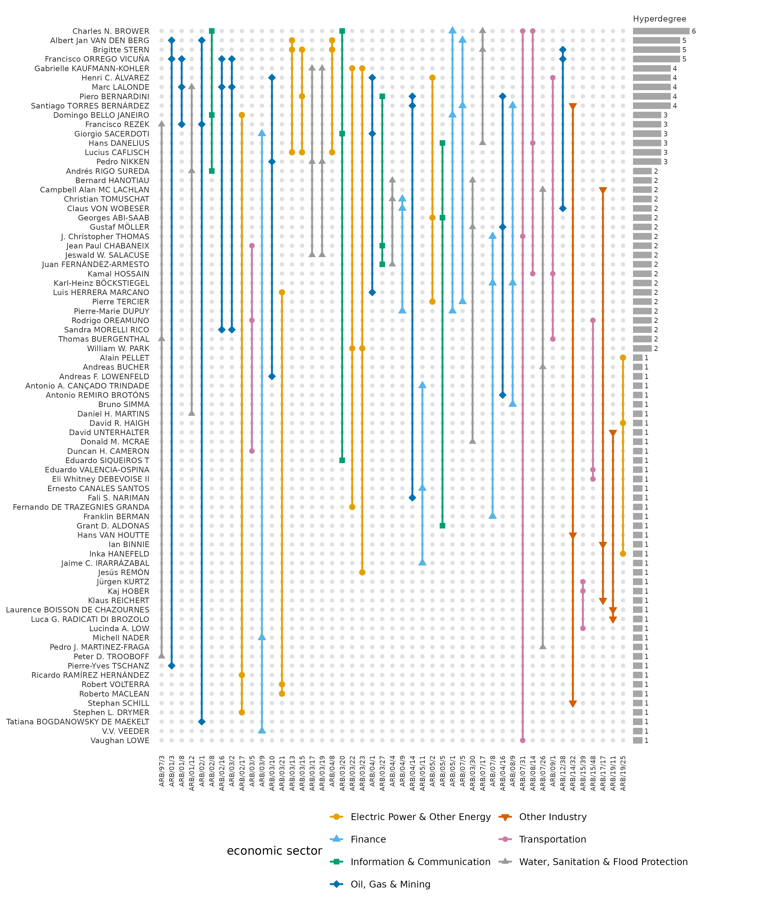
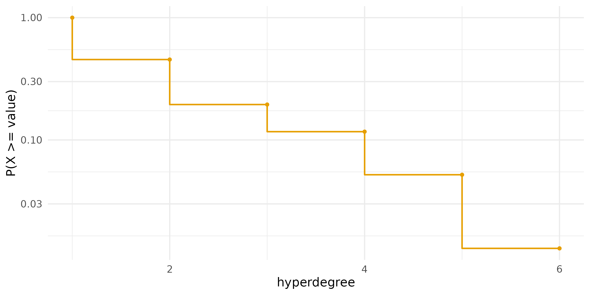
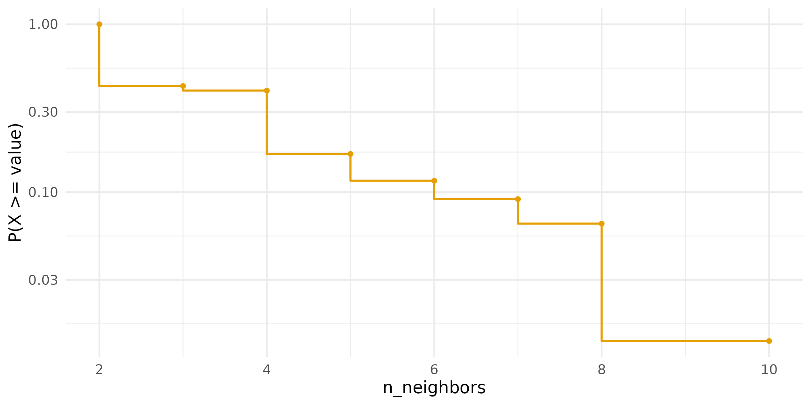
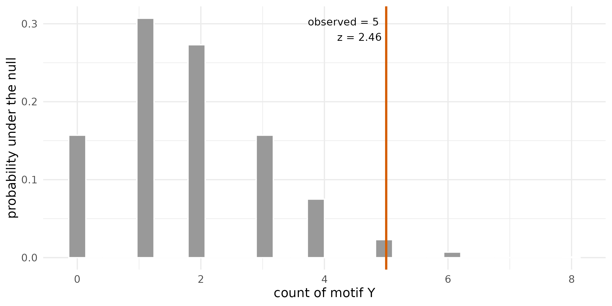
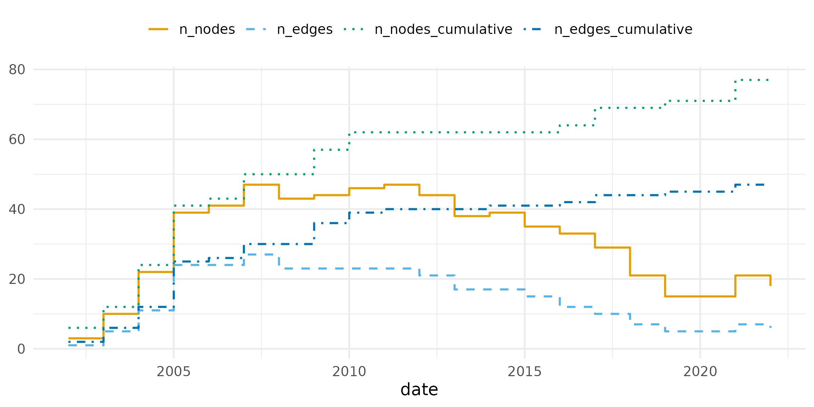
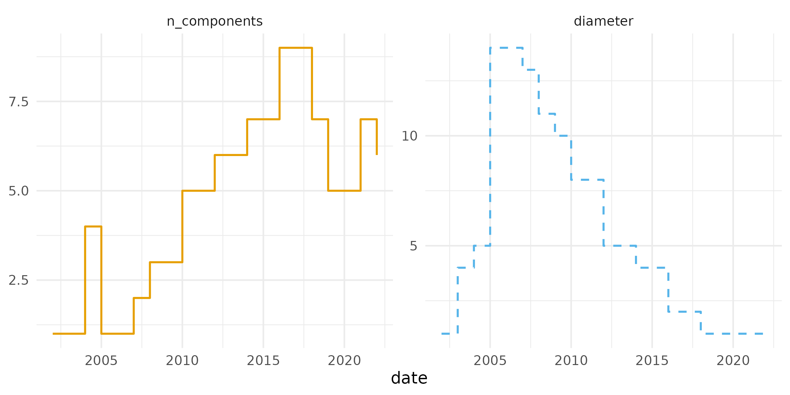
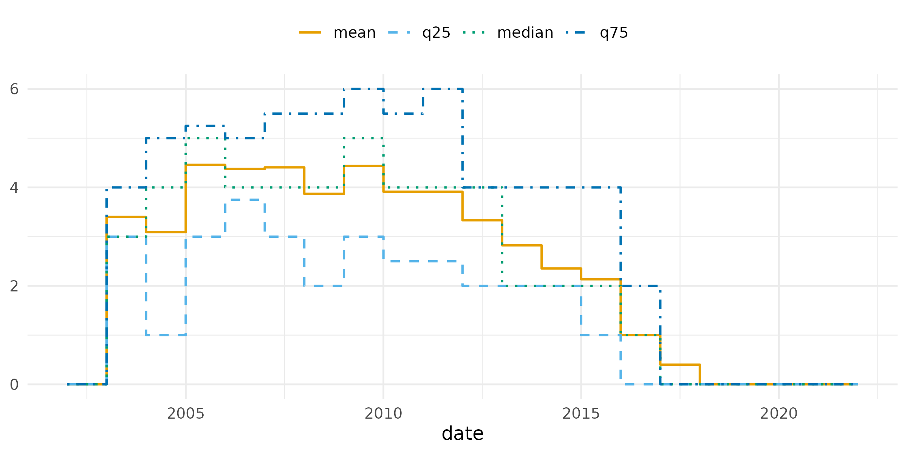
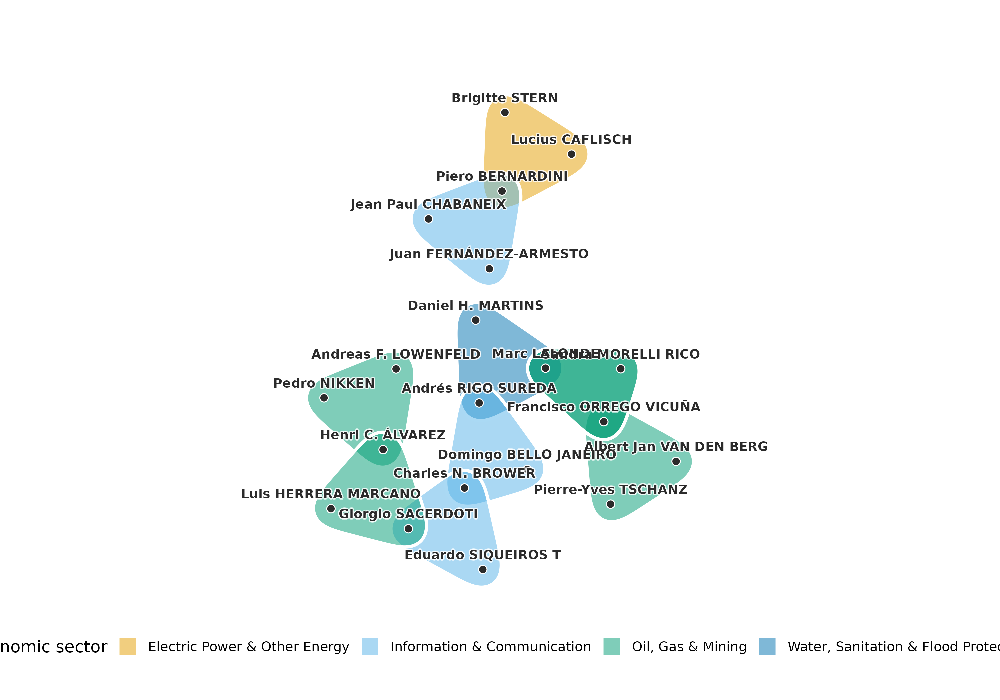
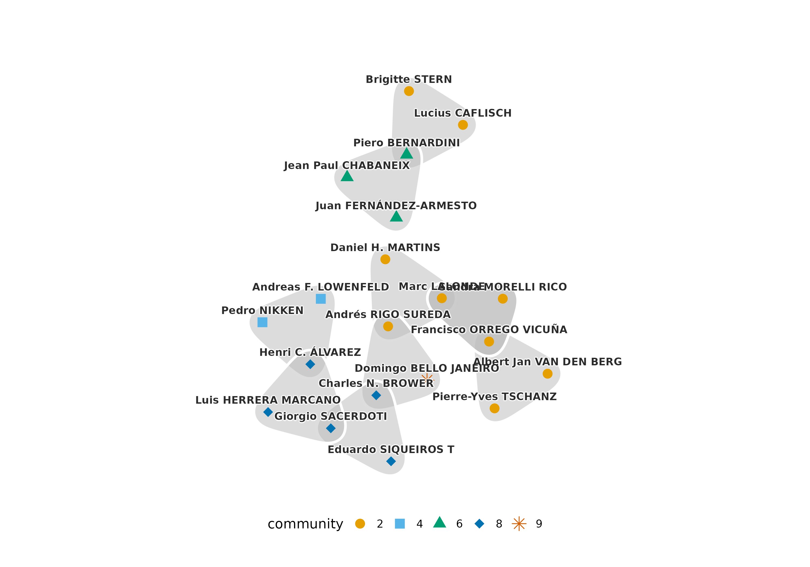

# Analysis of ICSID tribunals in claims against Argentina

Of the 742 cases of the International Centre for Settlement of
Investment Disputes (ICSID) in the `icsid_tribunals` data, 47 were
brought against the Argentine Republic, the largest number against any
state. Each case is heard by a tribunal of three arbitrators, and the
tribunals of the claims against one state form a temporal hypergraph.
Its nodes are the arbitrators, its hyperedges the tribunals, and each
hyperedge is active from the constitution of the tribunal to the
conclusion of its case. A hypergraph keeps the tribunal as a unit, where
a network of pairs of arbitrators dissolves it into three ties, and its
temporal form keeps apart tribunals that never sat at the same time.
This document asks three questions of the tribunals in the claims
against Argentina. The first is who decided the claims, and how
concentrated the seats were. The second is whether the same panels sat
again more often than the numbers of tribunals of the arbitrators imply.
The third is how the structure of the docket changed over two decades,
and which tribunals connected it at each time. The tribunals are
analysed over time and compared with the other ICSID cases.

## Data

The cases against Argentina are the rows of `icsid_tribunals` with
Argentina as the respondent, one row per seat on a tribunal.

``` r

argentina <- subset(icsid_tribunals, respondent == "Argentine Republic")
```

The 47 cases were heard by 77 arbitrators. Their tribunals were
constituted between 1997 and 2020, 26 of them before 2006 and 19 in 2003
and 2004 alone. 6 cases are marked as pending on 15 June 2023, the end
of observation. One of these, ARB/14/32, also carries a conclusion date,
5 November 2021, and its tribunal is treated as concluded on that date.

## The temporal hypergraph

The tribunals are built in the interval format. A case without a
conclusion date is active until `observation_end`, and the columns that
are constant within a case, such as the economic sector, are kept as
attributes of the hyperedge. The same construction on all ICSID
tribunals, and on the tribunals of the cases against other states, gives
the systems the claims against Argentina are compared with.

``` r

tribunals <- temporal_hypergraph(argentina, node = "arbitrator",
                                 hyperedge = "case", start = "constituted",
                                 end = "concluded",
                                 observation_end = as.Date("2023-06-15"))
summary(tribunals)
#>   n_nodes n_hyperedges n_event_times first_time last_time n_memberships
#> 1      77           47            82          0      9018           141
#>   mean_edge_size median_edge_size mean_duration   format time_unit
#> 1              3                3      2449.143 interval      days
all_tribunals <- temporal_hypergraph(icsid_tribunals, node = "arbitrator",
                                     hyperedge = "case", start = "constituted",
                                     end = "concluded",
                                     observation_end = as.Date("2023-06-15"))
others <- subset(icsid_tribunals, respondent != "Argentine Republic")
other_tribunals <- temporal_hypergraph(others, node = "arbitrator",
                                       hyperedge = "case", start = "constituted",
                                       end = "concluded",
                                       observation_end = as.Date("2023-06-15"))
```

A tribunal in the claims against Argentina sits for 6.7 years on
average. The cumulative snapshot at the end of observation is the static
aggregate of all tribunals. Four representations of the aggregate differ
in what they keep. The multi-hypergraph (`mh`) keeps every tribunal, the
binary hypergraph (`bh`) keeps each distinct set of arbitrators once,
and the clique expansions keep (`mg`) or merge (`bg`) the repeated pairs
of arbitrators.

``` r

argentina_all <- hg_snapshot(tribunals, mode = "cumulative")
icsid_all <- hg_snapshot(all_tribunals, mode = "cumulative")
others_all <- hg_snapshot(other_tribunals, mode = "cumulative")
hg_representations(argentina_all)
#>   representation       type n_nodes n_edges mean_degree median_degree
#> 1             bg      graph      77     127    3.298701             2
#> 2             mg      graph      77     141    3.662338             2
#> 3             bh hypergraph      77      44    1.714286             1
#> 4             mh hypergraph      77      47    1.831169             1
```

The clique expansion turns the 47 tribunals into 141 ties between pairs
of arbitrators, of which 127 are distinct. Nothing in the graph records
that three ties came from one tribunal, so the repeated panels examined
below are invisible in it. The 47 tribunals hold 44 distinct sets of
arbitrators, so 6% of them repeat a panel that sat before, against 2% of
the tribunals in the cases against other states.

## Who decided the claims

The incidence view plots one row per arbitrator and one column per
tribunal, with a bar joining the three members of each tribunal. Rows
are ordered by the number of tribunals, and columns by the date of
constitution. Colour and shape mark the economic sector.

``` r

plot(argentina_all, type = "incidence", color_by = "economic_sector",
     sort_by = "start", edge_labels = TRUE,
     legend_title = "economic sector")
```



A tribunal that repeats a panel appears as a second column with dots in
the same three rows. The 3 repeated panels are the pairs ARB/03/13 and
ARB/04/8, ARB/02/16 and ARB/03/2, ARB/03/17 and ARB/03/19. All were
constituted in 2003 and 2004, and the two tribunals of 2 of the pairs on
the same day. The 9 arbitrators with four or more tribunals hold the top
rows, and 66% of their seats are on tribunals constituted before 2006.

The hyperdegree of an arbitrator is the number of tribunals on which the
arbitrator sat, and the degree in the clique expansion is the number of
distinct colleagues.

``` r

hg_get(argentina_all, what = "nodes", sort_by = "degree", top = 5)
#>                        node degree
#> 1         Charles N. BROWER      6
#> 2   Albert Jan VAN DEN BERG      5
#> 3            Brigitte STERN      5
#> 4   Francisco ORREGO VICUÑA      5
#> 5 Gabrielle KAUFMANN-KOHLER      4
tribunal_counts <- hg_measures(argentina_all, what = "distribution",
                               measure = "hyperdegree")
colleague_counts <- hg_measures(argentina_all, what = "distribution",
                                measure = "n_neighbors")
```

The figures plot the complementary cumulative distributions of the
number of tribunals and of the number of colleagues of an arbitrator.

``` r

plot(tribunal_counts)
```



``` r

plot(colleague_counts)
```



Of the arbitrators, 55% sat on a single tribunal in these cases, and
Charles N. BROWER sat on 6. The largest number of colleagues is 10. The
ten arbitrators with the most tribunals, 13% of the arbitrators, hold
31% of the seats in the claims against Argentina; in the cases against
other states the ten busiest arbitrators hold 20%.

Degree assortativity asks whether arbitrators with many tribunals sit
with other arbitrators with many tribunals. From each tribunal a pair of
arbitrators is chosen at random, and the coefficient is the rank
correlation of their numbers of tribunals over all tribunals, a
generalised Spearman coefficient.

``` r

hg_assortativity(argentina_all)
#>      type scale assortativity n_edges
#> 1 uniform  rank     0.2509363      47
hg_assortativity(others_all)
#>      type scale assortativity n_edges
#> 1 uniform  rank     0.1467613     695
```

The coefficient is 0.25 for the claims against Argentina and 0.15 for
the cases against other states. In both, the busier arbitrators tend to
share tribunals with each other, and the tendency is stronger in the
claims against Argentina.

## Repeated panels

A repeated collaboration is a pair or a set of three arbitrators who sit
together on more than one tribunal. The statistic `repeated_pairs` is
the number of pairs counted with their multiplicity minus the number of
distinct pairs, and `repeated_edges` is the number of tribunals whose
set of arbitrators sat before. Whether these counts exceed what the
numbers of tribunals of the arbitrators imply is tested against a null
model. The swap null keeps the number of tribunals of every arbitrator
and the size of every tribunal exactly and randomises the memberships by
checkerboard swaps. The assignment null is a looser alternative, in
which the arbitrators are taken in decreasing order of hyperdegree and
assigned at random to tribunals with a free seat. Both are reported,
each with 999 draws.

``` r

repeats_swap <- hg_null_test(argentina_all,
                             statistic = c("repeated_pairs", "repeated_edges"),
                             method = "swap", n = 999, seed = 1)
repeats_swap
#>        statistic observed  null_mean null_lo null_hi        z p_value   n
#> 1 repeated_pairs       14 2.09109109       0       7 6.276624   0.001 999
#> 2 repeated_edges        3 0.07807808       0       1 8.804718   0.003 999
#>   method
#> 1   swap
#> 2   swap
repeats_assignment <- hg_null_test(argentina_all,
                                   statistic = c("repeated_pairs", "repeated_edges"),
                                   method = "assignment", n = 999, seed = 1)
repeats_assignment
#>        statistic observed  null_mean null_lo null_hi         z p_value   n
#> 1 repeated_pairs       14 3.80080080       1       8  5.800674   0.001 999
#> 2 repeated_edges        3 0.03503504       0       1 16.117402   0.001 999
#>       method
#> 1 assignment
#> 2 assignment
```

The same test on all ICSID tribunals, and on the tribunals of the cases
against other states, tells whether the claims against Argentina differ
from the system.

``` r

repeats_icsid <- hg_null_test(icsid_all,
                              statistic = c("repeated_pairs", "repeated_edges"),
                              method = "swap", n = 999, seed = 1)
repeats_icsid
#>        statistic observed null_mean null_lo null_hi        z p_value   n method
#> 1 repeated_pairs      357 328.77978     305     354 2.086455   0.001 999   swap
#> 2 repeated_edges       20  12.51451       7      20 1.865566   0.034 999   swap
repeats_other <- hg_null_test(others_all,
                              statistic = c("repeated_pairs", "repeated_edges"),
                              method = "swap", n = 999, seed = 1)
repeats_other
#>        statistic observed null_mean null_lo null_hi        z p_value   n method
#> 1 repeated_pairs      330 299.41141     267     330 1.412722   0.130 999   swap
#> 2 repeated_edges       17  11.28328       6      17 1.439547   0.105 999   swap
```

Against the swap null, the claims against Argentina contain 14 repeated
pairs (null range 0 to 7, z = 6.3) and 3 repeated panels (null range 0
to 1, z = 8.8, p = 0.003). The assignment null gives z = 5.8 for the
pairs and z = 16.1 for the panels. Across all 742 ICSID tribunals, the
excess is modest: z = 2.1 for the 357 repeated pairs and z = 1.9 for the
20 repeated panels (p = 0.03). Without the claims against Argentina it
disappears. In the cases against other states, neither the 330 repeated
pairs (p = 0.13) nor the 17 repeated panels (p = 0.10) differ from the
swap null. Under the null that keeps every margin exactly, the
repetition of arbitrators and panels found in ICSID as a whole is the
repetition in the claims against Argentina.

## Motifs

In a hypergraph whose hyperedges all have three nodes, four nodes can
hold up to four hyperedges. The motif Y has two of them, two tribunals
that share two arbitrators; T has three and O has all four. A motif
count is compared with its distribution under a configuration model that
keeps the hyperdegree of every node and the size of every hyperedge. The
census of the aggregate uses 1,000 draws.

``` r

motifs <- hg_motifs(argentina_all, n = 1000, seed = 1)
motifs
#>   motif count expected  null_sd        z    p_value     delta normalized_delta
#> 1     Y     5    1.789 1.304791 2.460931 0.03196803 0.2976179                1
#> 2     T     0    0.000 0.000000       NA 1.00000000 0.0000000                0
#> 3     O     0    0.000 0.000000       NA 1.00000000 0.0000000                0
#>   n_null             method
#> 1   1000 configuration_mcmc
#> 2   1000 configuration_mcmc
#> 3   1000 configuration_mcmc
```

``` r

plot(motifs)
```



The aggregate contains 5 motifs Y against a null mean of 1.8 (z = 2.5, p
= 0.032), and the motifs T and O do not occur. The aggregate joins
tribunals that never sat at the same time, so the census is repeated on
the snapshot of the first of January of each year, which holds only the
tribunals active together on that day.

``` r

years <- seq(as.Date("2003-01-01"), as.Date("2015-01-01"), by = "year")
yearly_motifs <- hg_motifs(tribunals, n = 300, seed = 1, at = years)
subset(yearly_motifs, motif == "Y",
       select = c(time, count, expected, z, p_value))
#>          time count  expected          z    p_value
#> 1  2003-01-01     0 0.5100000 -0.8879306 0.57142857
#> 4  2004-01-01     1 0.4800000  0.8477259 0.42192691
#> 7  2005-01-01     3 0.9833333  1.9086503 0.08970100
#> 10 2006-01-01     2 0.6700000  1.7250435 0.13289037
#> 13 2007-01-01     3 0.8266667  2.4985428 0.05980066
#> 16 2008-01-01     2 0.5900000  2.0036146 0.10963455
#> 19 2009-01-01     1 0.6033333  0.5368263 1.00000000
#> 22 2010-01-01     2 0.6033333  1.8901700 0.12292359
#> 25 2011-01-01     1 0.4533333  0.8854651 0.39202658
#> 28 2012-01-01     1 0.3866667  1.0168384 0.33222591
#> 31 2013-01-01     0 0.1766667 -0.4529584 1.00000000
#> 34 2014-01-01     0 0.1666667 -0.4368520 1.00000000
#> 37 2015-01-01     0 0.1000000 -0.3216338 1.00000000
```

No snapshot holds more than 3 motifs Y, and the smallest p-value of a
snapshot is 0.06. The counts on a single day are too small for the test
to separate them from the null, and the excess is established only for
the aggregate.

## How the docket changed

Growth counts the active tribunals and arbitrators at each time, and the
columns ending in `_cumulative` count every tribunal begun by that time.
With `components = TRUE`, the number of connected components of the
active hypergraph, the share of its arbitrators in the largest component
and the diameter of that component are added. The grid is the first of
January of each year from 2002 to 2022.

``` r

grid <- seq(as.Date("2002-01-01"), as.Date("2022-01-01"), by = "year")
docket <- hg_growth(tribunals, components = TRUE, at = grid)
```

``` r

plot(docket,
     columns = c("n_nodes", "n_edges", "n_nodes_cumulative",
                 "n_edges_cumulative"),
     facets = FALSE)
```



``` r

plot(docket, columns = c("n_components", "diameter"), facets = TRUE)
```



On the first of January of 2005 and 2006, every active tribunal belonged
to one connected component, with up to 41 arbitrators linked through
shared seats. The two most distant arbitrators of that component were 14
steps apart in 2005, each step a tribunal on which two arbitrators sat
together. The component broke apart afterwards, and in 2022 the 6 active
tribunals formed 6 separate components. The number of active arbitrators
per active tribunal fell to 1.62 in 2005, when the active tribunals
shared many of their arbitrators, and rose to 3.00 in 2022, when no two
active tribunals shared one.

The neighbourhood of a tribunal is the set of arbitrators who share a
tribunal with one of its members.

``` r

neighbourhood <- hg_edges(tribunals, what = "summary", measure = "n_neighbors",
                          at = grid)
```

``` r

plot(neighbourhood, columns = c("mean", "q25", "median", "q75"),
     facets = FALSE)
```



The mean neighbourhood of an active tribunal peaks at 4.5 arbitrators in
2005.

## Which tribunals held the docket together

The s-betweenness of a tribunal is its betweenness centrality in the
s-line graph, in which two tribunals are adjacent when they share at
least *s* arbitrators. With *s* = 1, a tribunal of high betweenness lies
on many of the shortest chains of shared arbitrators between other
tribunals. Computed on the snapshot of each year, it shows which
tribunal bridged the docket at each time.

``` r

bridges <- hg_edge_centrality(tribunals, s = 1, measure = "betweenness",
                              at = grid, top = 1)
bridges
#>          time      edge s     measure      value
#> 1  2002-01-01  ARB/01/3 1 betweenness 0.00000000
#> 2  2003-01-01  ARB/01/8 1 betweenness 0.66666667
#> 3  2004-01-01 ARB/01/12 1 betweenness 0.22222222
#> 4  2005-01-01  ARB/02/8 1 betweenness 0.54940711
#> 5  2006-01-01  ARB/02/8 1 betweenness 0.54940711
#> 6  2007-01-01  ARB/05/1 1 betweenness 0.49692308
#> 7  2008-01-01  ARB/05/1 1 betweenness 0.46320346
#> 8  2009-01-01  ARB/04/1 1 betweenness 0.47186147
#> 9  2010-01-01 ARB/07/17 1 betweenness 0.15151515
#> 10 2011-01-01 ARB/07/17 1 betweenness 0.12987013
#> 11 2012-01-01 ARB/03/10 1 betweenness 0.06315789
#> 12 2013-01-01 ARB/03/10 1 betweenness 0.07500000
#> 13 2014-01-01 ARB/03/10 1 betweenness 0.02500000
#> 14 2015-01-01 ARB/03/10 1 betweenness 0.03296703
#> 15 2016-01-01 ARB/02/17 1 betweenness 0.00000000
#> 16 2017-01-01 ARB/02/17 1 betweenness 0.00000000
#> 17 2018-01-01 ARB/02/17 1 betweenness 0.00000000
#> 18 2019-01-01 ARB/02/17 1 betweenness 0.00000000
#> 19 2020-01-01 ARB/02/17 1 betweenness 0.00000000
#> 20 2021-01-01 ARB/02/17 1 betweenness 0.00000000
#> 21 2022-01-01 ARB/02/17 1 betweenness 0.00000000
```

The bridge changes over time: 7 tribunals hold the highest betweenness
in at least one year. From 2016 on, no active tribunal lies between two
others, because the active tribunals no longer share arbitrators.

On 1 June 2006, near the peak of the docket, the backbone is the ten
tribunals of highest betweenness in the snapshot of that day.

``` r

peak <- hg_snapshot(tribunals, at = as.Date("2006-06-01"))
backbone_cases <- hg_edge_centrality(peak, s = 1, measure = "betweenness",
                                     top = 10)
backbone <- hg_subset(peak, edges = backbone_cases)
```

``` r

plot(backbone, color_by = "economic_sector", legend_title = "economic sector")
```



On that day 25 tribunals were active. The ten tribunals of the backbone
span 4 economic sectors and are joined through a few arbitrators;
Francisco ORREGO VICUÑA sits on 3 of them.

The aggregate hypergraph gives a different backbone. Closeness computed
on all tribunals at once ranks tribunals as close to each other whether
or not they were ever active together.

``` r

aggregate_cases <- hg_edge_centrality(argentina_all, s = 1,
                                      measure = "closeness", top = 10)
aggregate_cases
#>         edge s   measure     value
#> 1  ARB/07/17 1 closeness 0.3864734
#> 2   ARB/07/5 1 closeness 0.3700278
#> 3  ARB/03/13 1 closeness 0.3585836
#> 4   ARB/04/8 1 closeness 0.3585836
#> 5  ARB/03/15 1 closeness 0.3478261
#> 6  ARB/03/20 1 closeness 0.3478261
#> 7  ARB/08/14 1 closeness 0.3478261
#> 8  ARB/12/38 1 closeness 0.3443823
#> 9   ARB/05/2 1 closeness 0.3376952
#> 10  ARB/02/8 1 closeness 0.3344482
```

Of the 45 pairs among these ten tribunals, 14 were never active at the
same time. A static centrality on the aggregate treats the docket as if
all of it had sat at once, which is the reason centrality is computed
here on snapshots.

## Communities of arbitrators

Hypergraph modularity measures the quality of a partition of the nodes
into communities, counting a hyperedge for a community when a majority
of its nodes belong to it. Iteratively reweighted modularity
maximisation (IRMM) finds a partition of high modularity, and Infomap
partitions the association graph by minimising the description length of
a random walk on it. Both are run from 20 seeds, and the partition
reported is the medoid, the run with the largest summed adjusted mutual
information with the other runs.

``` r

irmm <- hg_communities(argentina_all, type = "irmm", seeds = 1:20,
                       n_runs = 20, max_iter = 300)
hg_modularity(argentina_all, irmm)
#>     type modularity edge_contribution degree_tax n_communities n_edges
#> 1 linear  0.6146005          0.893617  0.2790165            11      47
#>   total_weight
#> 1           47
infomap <- hg_communities(argentina_all, seeds = 1:20, n_runs = 20)
hg_modularity(argentina_all, infomap)
#>     type modularity edge_contribution degree_tax n_communities n_edges
#> 1 linear  0.6401226         0.8510638  0.2109413            14      47
#>   total_weight
#> 1           47
hg_agreement(irmm, infomap, method = c("ari", "ami"))
#>    n agreement aligned       ari       ami
#> 1 77 0.3116883      58 0.6141959 0.7615006
```

The IRMM medoid has 11 communities of between 3 and 14 arbitrators and a
modularity of 0.615, and its runs agree with a median adjusted mutual
information of 0.92. The Infomap medoid has 14 communities and a
modularity of 0.640, and its runs agree with a median of 1.00. The two
medoids agree with an adjusted Rand index of 0.61 and an adjusted mutual
information of 0.76. The figure plots the backbone of 1 June 2006 with
each arbitrator coloured and shaped by its IRMM community.

``` r

plot(backbone, node_groups = irmm)
```



## Argentina and the other cases

|  | claims against Argentina | cases against other states |
|:---|:---|:---|
| tribunals | 47 | 695 |
| arbitrators | 77 | 420 |
| share of seats held by the ten busiest arbitrators | 31% | 20% |
| share of tribunals that repeat a panel | 6% | 2% |
| degree assortativity | 0.25 | 0.15 |
| repeated panels, z against the swap null | 8.8 | 1.4 |
