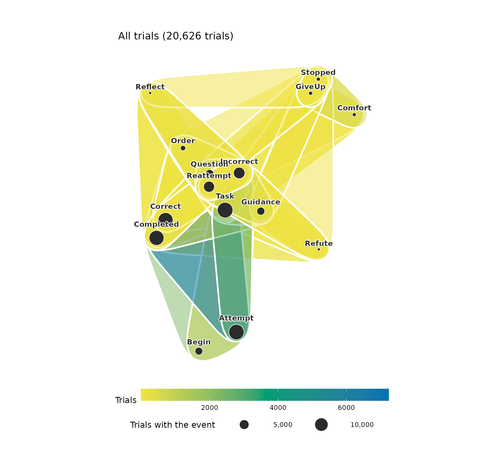
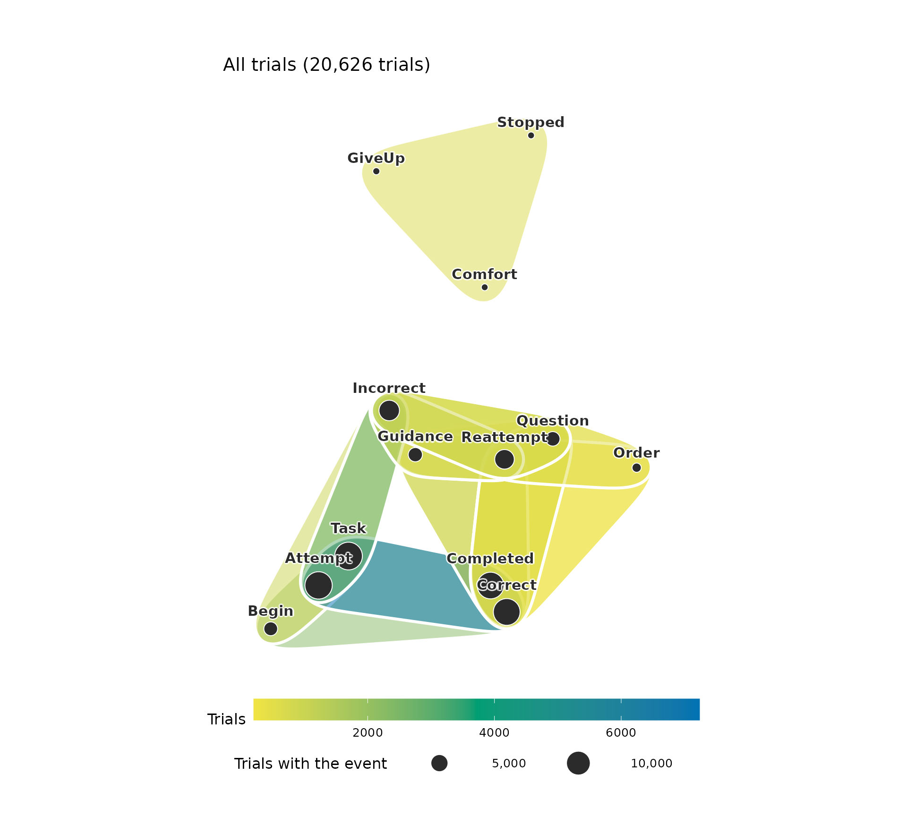
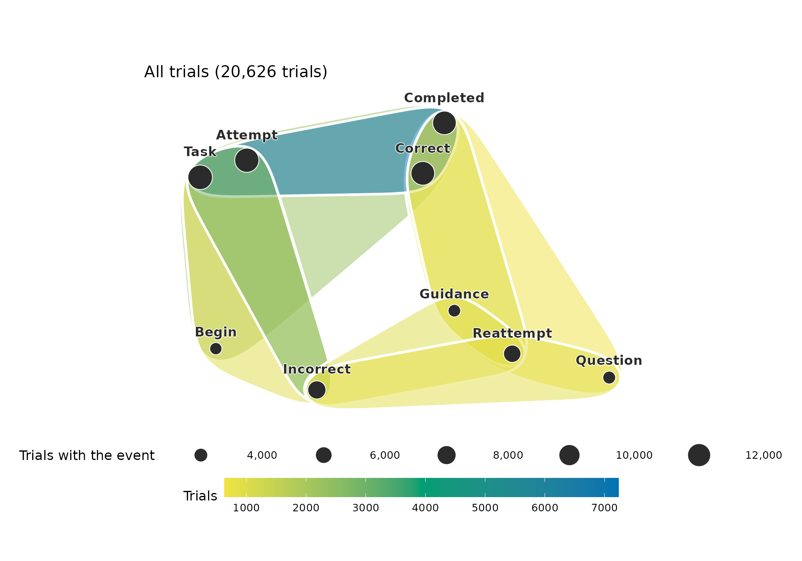
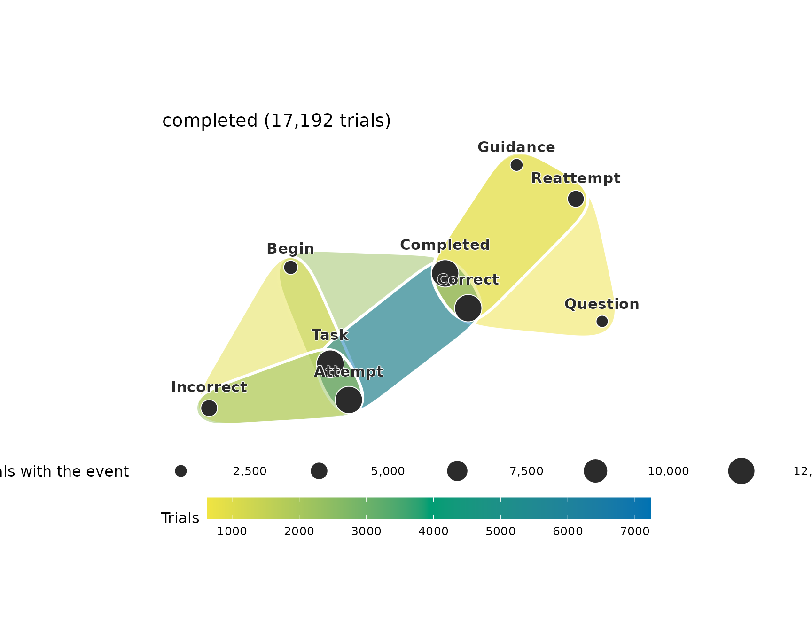
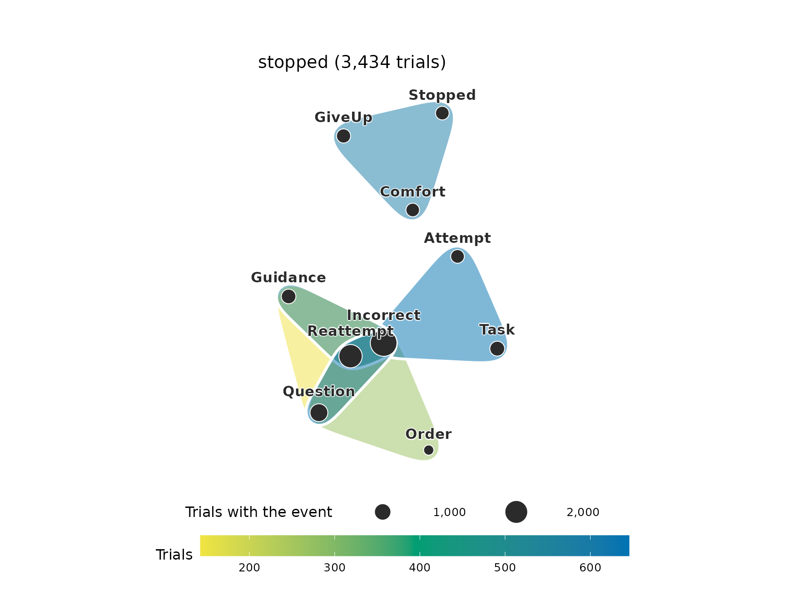
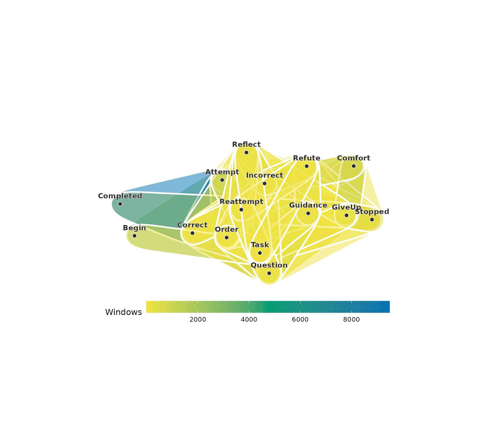
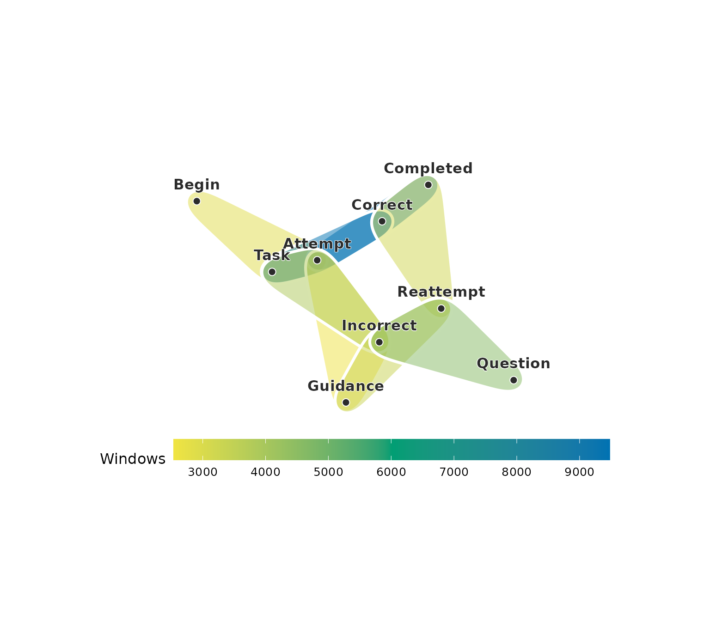
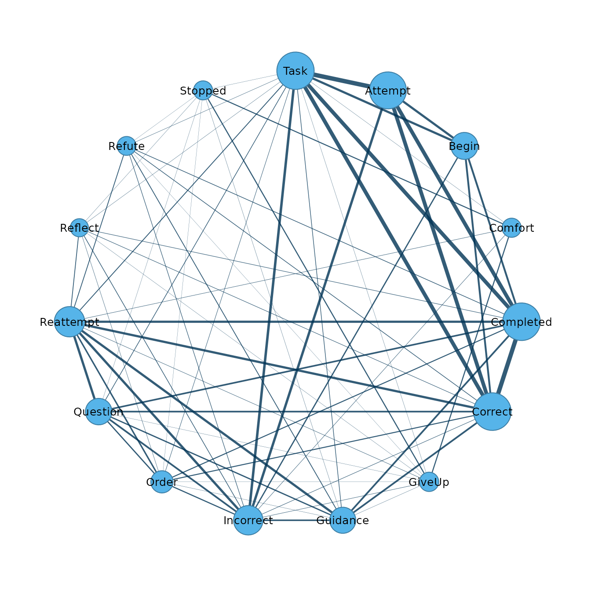
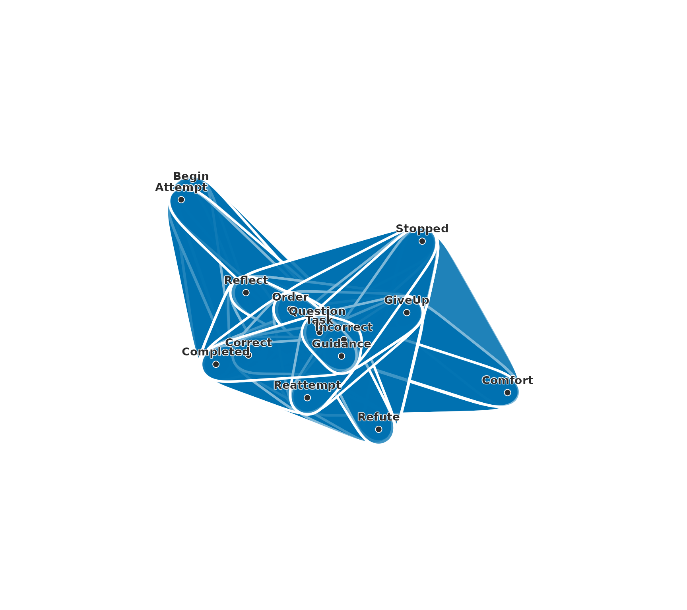
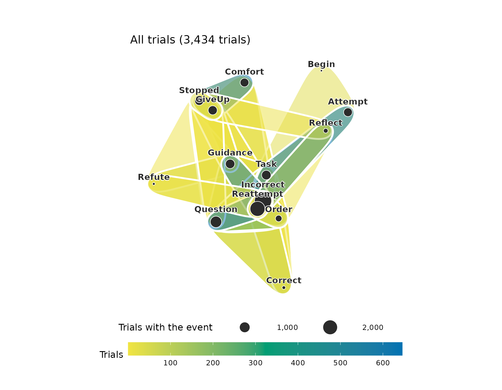

# Hypergraphs

Higher-order network models extend pairwise networks in two directions.
One represents interactions among groups of nodes with hypergraphs and
simplicial complexes; the other represents memory in paths. This
document covers hypergraphs. A hypergraph consists of a set of nodes and
a set of hyperedges, and a hyperedge is a subset of the nodes of any
size. An edge of a network is the special case of a hyperedge with two
nodes. A hypergraph is represented by its incidence matrix, which has
one row per node, one column per hyperedge, and an entry of one where
the node belongs to the hyperedge. The projection of a hypergraph to a
network replaces each hyperedge by the pairs of its nodes, and different
hypergraphs can have the same projection. Measures computed from the
incidence matrix keep the information that the projection loses.

## Data

The examples use `tutoring_events`, a data frame in long format with one
row per event, from 13,309 problem steps that learners worked through
with an AI tutor. A step begins with the task, the learner attempts an
answer, and the answer is correct or incorrect. After an incorrect
answer the tutor responds with guidance, a question, an order, a
refutation, a prompt to reflect or comfort, and the learner reattempts
or gives up. A step ends with `Completed` after a correct answer and
with `Stopped` when it ends without one. A trial is the part of a step
between two answers.

``` r

library(hypergraphs)
head(tutoring_events, 12)
#>    step   trial position     event   outcome
#> 1     1 00001.1        1     Begin completed
#> 2     1 00001.1        2      Task completed
#> 3     1 00001.1        3   Attempt completed
#> 4     1 00001.1        4   Correct completed
#> 5     1 00001.1        5 Completed completed
#> 6     2 00002.1        1      Task   stopped
#> 7     2 00002.1        2   Attempt   stopped
#> 8     2 00002.1        3 Incorrect   stopped
#> 9     2 00002.2        4  Question   stopped
#> 10    2 00002.2        5  Guidance   stopped
#> 11    2 00002.2        6  Question   stopped
#> 12    2 00002.2        7 Reattempt   stopped
```

The data contain 20,626 trials and 15 distinct events.

## Hypergraphs from observed groups

When group membership is observed, each group is a hyperedge. In an
event log, the events of a session form such a group, and a trial is a
session in this sense. In
[`hypergraph()`](https://pak.dynasite.org/hypergraphs/reference/hypergraph.md),
`action` names the column of the events and `session` the column of the
trials, and the events of each trial become one hyperedge.

``` r

trial_hg <- hypergraph(tutoring_events, action = "event", session = "trial")
trial_hg
#> Hypergraph: 15 nodes, 20626 hyperedges (sizes 2: 52, 3: 5734, 4: 11219, 5: 3551, 6: 70)
#> Source: group membership (node = event, hyperedge = trial)
#>  hyperedge size                                  members
#>    00001.1    5 Attempt, Begin, Completed, Correct, Task
#>    00002.1    3                 Attempt, Incorrect, Task
#>    00002.2    4 Guidance, Incorrect, Question, Reattempt
#>    00002.3    3           Incorrect, Question, Reattempt
#>    00002.4    4 Guidance, Incorrect, Question, Reattempt
#>    00002.5    3                 Comfort, GiveUp, Stopped
#>    00003.1    4        Attempt, Completed, Correct, Task
#>    00004.1    3                 Attempt, Incorrect, Task
#>    00004.2    2                     Incorrect, Reattempt
#>    00004.3    4 Guidance, Incorrect, Question, Reattempt
#> ... 20616 more rows
```

Most trials contain 4 events, and the largest contain 6. Many trials
contain the same events: the 20,626 trials hold 56 distinct sets. A
hypergraph whose hyperedges repeat is plotted as its distinct sets.

``` r

plot(trial_hg)
```



Each set is plotted as a hull coloured by its number of trials, and each
event as a circle whose area is the number of trials that contain it.
Most of the sets are rare and overlap the frequent ones. The minimum
support of frequent-set mining keeps the sets that occur in at least a
given share of the trials. With `min_share = 0.01`, the sets of at least
1% of the trials are kept.

``` r

common_trials <- hypergraph(tutoring_events, action = "event",
                            session = "trial", min_share = 0.01)
common_trials
#> Hypergraph: 13 nodes, 14 hyperedges (sizes 3: 4, 4: 7, 5: 3)
#> Source: sets of event per trial, counted over all of them (sets of at least 1% per group)
#>                                              hyperedge size
#>           Attempt + Begin + Completed + Correct + Task    5
#>                     Attempt + Begin + Incorrect + Task    4
#>                   Attempt + Completed + Correct + Task    4
#>                             Attempt + Incorrect + Task    3
#>                             Comfort + GiveUp + Stopped    3
#>  Completed + Correct + Guidance + Question + Reattempt    5
#>             Completed + Correct + Guidance + Reattempt    4
#>     Completed + Correct + Order + Question + Reattempt    5
#>                Completed + Correct + Order + Reattempt    4
#>             Completed + Correct + Question + Reattempt    4
#>                                            members
#>           Attempt, Begin, Completed, Correct, Task
#>                    Attempt, Begin, Incorrect, Task
#>                  Attempt, Completed, Correct, Task
#>                           Attempt, Incorrect, Task
#>                           Comfort, GiveUp, Stopped
#>  Completed, Correct, Guidance, Question, Reattempt
#>            Completed, Correct, Guidance, Reattempt
#>     Completed, Correct, Order, Question, Reattempt
#>               Completed, Correct, Order, Reattempt
#>            Completed, Correct, Question, Reattempt
#> ... 4 more rows
```

``` r

plot(common_trials)
```



The 14 sets cover 93% of the trials. The sets of a stopped step, with
`Comfort`, `GiveUp` and `Stopped`, lie apart from the sets of the first
trial and the reattempts.

The degree of an event is the number of hyperedges that contain it.

``` r

trial_nodes <- hg_get(trial_hg, what = "nodes", sort_by = "degree")
trial_nodes
#>         node degree
#> 1       Task  13700
#> 2    Attempt  13309
#> 3    Correct  12725
#> 4  Completed  12637
#> 5  Incorrect   7317
#> 6  Reattempt   6645
#> 7   Question   3482
#> 8   Guidance   3353
#> 9      Begin   3148
#> 10     Order   1324
#> 11    GiveUp    728
#> 12   Stopped    672
#> 13   Comfort    666
#> 14    Refute    333
#> 15   Reflect    318
```

## Frequent sets

Most trials fall into a few of the 56 sets. Counting the sets and
keeping the most frequent ones as hyperedges summarises the data by its
common combinations. With `top = 8`, the eight most frequent sets are
kept.

``` r

trial_sets <- hypergraph(tutoring_events, action = "event",
                         session = "trial", top = 8)
trial_set_table <- hg_get(trial_sets, what = "sets")
trial_set_table
#>        group                                             hyperedge
#> 1 All trials                  Attempt + Completed + Correct + Task
#> 2 All trials                            Attempt + Incorrect + Task
#> 3 All trials          Attempt + Begin + Completed + Correct + Task
#> 4 All trials                      Guidance + Incorrect + Reattempt
#> 5 All trials            Completed + Correct + Guidance + Reattempt
#> 6 All trials                    Attempt + Begin + Incorrect + Task
#> 7 All trials                      Incorrect + Question + Reattempt
#> 8 All trials Completed + Correct + Guidance + Question + Reattempt
#>                                                     set size count      share
#> 1                  Attempt + Completed + Correct + Task    4  7229 0.35047998
#> 2                            Attempt + Incorrect + Task    3  2932 0.14215068
#> 3          Attempt + Begin + Completed + Correct + Task    5  2245 0.10884321
#> 4                      Guidance + Incorrect + Reattempt    3   975 0.04727044
#> 5            Completed + Correct + Guidance + Reattempt    4   973 0.04717347
#> 6                    Attempt + Begin + Incorrect + Task    4   903 0.04377970
#> 7                      Incorrect + Question + Reattempt    3   865 0.04193736
#> 8 Completed + Correct + Guidance + Question + Reattempt    5   638 0.03093183
```

The eight sets account for 81% of the trials. The most frequent set,
Attempt + Completed + Correct + Task, is a step completed on its first
trial. The next are a first trial with an incorrect answer, a correct
first trial that opens with `Begin`, and reattempts after guidance or a
question, which are correct or incorrect.

``` r

plot(trial_sets)
```



With `group`, the sets are counted separately within each value of a
comparison variable. The `outcome` column records whether a step is
completed with a correct answer or stopped without one.

``` r

outcome_sets <- hypergraph(tutoring_events, action = "event",
                         session = "trial", group = "outcome", top = 6)
outcome_set_table <- hg_get(outcome_sets, what = "sets")
outcome_set_table
#>        group                                                        hyperedge
#> 1  completed                  completed: Attempt + Completed + Correct + Task
#> 2  completed                            completed: Attempt + Incorrect + Task
#> 3  completed          completed: Attempt + Begin + Completed + Correct + Task
#> 4  completed            completed: Completed + Correct + Guidance + Reattempt
#> 5  completed                    completed: Attempt + Begin + Incorrect + Task
#> 6  completed completed: Completed + Correct + Guidance + Question + Reattempt
#> 7    stopped                              stopped: Attempt + Incorrect + Task
#> 8    stopped                        stopped: Incorrect + Question + Reattempt
#> 9    stopped                              stopped: Comfort + GiveUp + Stopped
#> 10   stopped                        stopped: Guidance + Incorrect + Reattempt
#> 11   stopped                stopped: Incorrect + Order + Question + Reattempt
#> 12   stopped             stopped: Guidance + Incorrect + Question + Reattempt
#>                                                      set size count      share
#> 1                   Attempt + Completed + Correct + Task    4  7229 0.42048627
#> 2                             Attempt + Incorrect + Task    3  2287 0.13302699
#> 3           Attempt + Begin + Completed + Correct + Task    5  2245 0.13058399
#> 4             Completed + Correct + Guidance + Reattempt    4   973 0.05659609
#> 5                     Attempt + Begin + Incorrect + Task    4   876 0.05095393
#> 6  Completed + Correct + Guidance + Question + Reattempt    5   638 0.03711028
#> 7                             Attempt + Incorrect + Task    3   645 0.18782761
#> 8                       Incorrect + Question + Reattempt    3   633 0.18433314
#> 9                             Comfort + GiveUp + Stopped    3   605 0.17617938
#> 10                      Guidance + Incorrect + Reattempt    3   536 0.15608620
#> 11              Incorrect + Order + Question + Reattempt    4   265 0.07716948
#> 12           Guidance + Incorrect + Question + Reattempt    4   143 0.04164240
```

``` r

plot(outcome_sets, group = "completed")
```



``` r

plot(outcome_sets, group = "stopped")
```



The frequent trials of completed steps are correct first trials,
incorrect first trials and correct reattempts after guidance or a
question. The frequent trials of stopped steps are incorrect first
trials and incorrect reattempts after a question, guidance or an order.
In the set `Comfort + GiveUp + Stopped` the tutor comforts the learner,
the learner gives up and the step ends without a correct answer.

## Hypergraphs from sequences

When only the order of events is recorded, hyperedges are formed from
windows of consecutive events in the sequence of events of each step.
Each window of `window` events is reduced to the set of its distinct
events, and identical sets are merged into one hyperedge whose weight is
the number of windows that produced it. The argument `action` names the
column of the events, `actor` the column of the steps and `time` the
column that orders the events.

``` r

window_hg <- hypergraph(tutoring_events, action = "event", actor = "step",
                        time = "position", window = 3)
window_hg
#> Hypergraph: 15 nodes, 103 hyperedges (sizes 1: 3, 2: 31, 3: 69)
#> Source: windowed sequences, window = 3, step = 1 (57738 windows from 13309 sequences)
#>  hyperedge size                       members weight
#>         h1    3          Attempt, Begin, Task   2848
#>         h2    3   Attempt, Completed, Correct   9474
#>         h3    3        Attempt, Correct, Task   9474
#>         h4    3    Attempt, GiveUp, Incorrect      1
#>         h5    3  Attempt, Guidance, Incorrect   2543
#>         h6    3     Attempt, Incorrect, Order    968
#>         h7    3  Attempt, Incorrect, Question    124
#>         h8    3 Attempt, Incorrect, Reattempt     15
#>         h9    3   Attempt, Incorrect, Reflect      3
#>        h10    3    Attempt, Incorrect, Refute    180
#> ... 93 more rows
window_edges <- hg_get(window_hg, sort_by = "weight", top = 8)
window_edges
#>   hyperedge size                        members weight
#> 1        h2    3    Attempt, Completed, Correct   9474
#> 2        h3    3         Attempt, Correct, Task   9474
#> 3       h78    3 Incorrect, Question, Reattempt   4589
#> 4       h11    3       Attempt, Incorrect, Task   3836
#> 5       h57    3 Guidance, Incorrect, Reattempt   3328
#> 6       h21    3  Completed, Correct, Reattempt   3163
#> 7        h1    3           Attempt, Begin, Task   2848
#> 8        h5    3   Attempt, Guidance, Incorrect   2543
```

``` r

plot(window_hg)
```



The 57,738 windows give 103 distinct hyperedges. A window with a
repeated event contains fewer distinct events than its length, so some
hyperedges have two nodes or one. With `min_weight`, only hyperedges
produced by at least that many windows are kept, and
[`hg_subset()`](https://pak.dynasite.org/hypergraphs/reference/hg_subset.md)
with `size = 3` keeps the windows of three distinct events and drops the
events left in none.

``` r

frequent_windows <- hypergraph(tutoring_events, action = "event",
                               actor = "step", time = "position",
                               window = 3, min_weight = 2000)
frequent_windows <- hg_subset(frequent_windows, size = 3)
frequent_windows
#> Hypergraph: 9 nodes, 8 hyperedges (sizes 3: 8)
#> Source: windowed sequences, window = 3, step = 1 (57738 windows from 13309 sequences)
#>  hyperedge size                        members weight
#>         h1    3           Attempt, Begin, Task   2848
#>         h2    3    Attempt, Completed, Correct   9474
#>         h3    3         Attempt, Correct, Task   9474
#>         h4    3   Attempt, Guidance, Incorrect   2543
#>         h5    3       Attempt, Incorrect, Task   3836
#>         h6    3  Completed, Correct, Reattempt   3163
#>         h7    3 Guidance, Incorrect, Reattempt   3328
#>         h8    3 Incorrect, Question, Reattempt   4589
```

``` r

plot(frequent_windows)
```



Each hull is a window of three events, coloured by the number of windows
that contain exactly these events. Windows span the boundaries between
trials, and the window length is set by the analyst. The remaining
sections use the trials, which the data record.

## Projection to a network

The projection of a hypergraph is the network in which two nodes are
joined when they belong to a common hyperedge, with a weight equal to
the number of such hyperedges.

``` r

trial_network <- pairwise_network(trial_hg)
trial_network_edges <- hg_get(trial_network, sort_by = "weight", top = 8)
trial_network_edges
#>        from        to weight
#> 1   Attempt      Task  13309
#> 2 Completed   Correct  12637
#> 3   Correct      Task   9653
#> 4 Completed      Task   9645
#> 5   Attempt Completed   9474
#> 6   Attempt   Correct   9474
#> 7 Incorrect      Task   4050
#> 8   Attempt Incorrect   3835
```

``` r

plot(trial_network)
```



Each edge joins two events with a width that grows with the number of
trials that contain both. The widest edges join `Task`, `Attempt`,
`Correct` and `Completed`, which occur together in most first trials,
and the edges of `Comfort`, `GiveUp` and `Stopped` are thin. The network
records how often two events occur in the same trial and leaves out
which other events occur with them.

A hypergraph can also be inferred from a network by taking every clique,
a set of nodes that are all joined to each other, as a hyperedge. With
`include_pairwise = FALSE` the cliques of three or more nodes are kept,
and `max_size` is the size of the largest clique kept, here the size of
the largest trial.

``` r

clique_hg <- hypergraph(trial_network, max_size = 6, include_pairwise = FALSE)
clique_hg
#> Hypergraph: 15 nodes, 401 hyperedges (sizes 3: 139, 4: 149, 5: 87, 6: 26)
#> Source: network cliques (p = 1.00, include_pairwise = FALSE, max_size = 6)
#>  hyperedge size                            members
#>         h1    3         Completed, Reattempt, Task
#>         h2    3         Incorrect, Reattempt, Task
#>         h3    3             Begin, Completed, Task
#>         h4    3             Begin, Incorrect, Task
#>         h5    3       GiveUp, Incorrect, Reattempt
#>         h6    4 GiveUp, Incorrect, Reattempt, Task
#>         h7    3            GiveUp, Reattempt, Task
#>         h8    3              GiveUp, Stopped, Task
#>         h9    3            GiveUp, Incorrect, Task
#>        h10    3          Begin, Completed, Correct
#> ... 391 more rows
```

``` r

plot(clique_hg)
```



The network has 68 pairs, and its cliques of three to 6 events give 401
hyperedges. The trials contain 54 distinct sets of three or more events,
and 54 of them are among the cliques. The other 347 cliques are sets
whose pairs each occur in some trial while the whole set occurs in none.
Identifying the observed groups among the cliques requires the
hypergraph. The cliques cover the events so densely that their hulls
hide one another in the plot.

## Node measures

Node measures of a hypergraph are computed from its incidence matrix.
The hyperdegree of a node is the number of hyperedges that contain it,
its strength is the sum of the sizes of those hyperedges, and its number
of neighbours is the number of other nodes that share a hyperedge with
it.

``` r

node_measures <- hg_measures(trial_hg)
node_measures
#>         node hyperdegree strength max_edge_size n_neighbors
#> 1    Attempt       13309    52549             5           5
#> 2      Begin        3148    14837             5           5
#> 3    Comfort         666     2063             5           5
#> 4  Completed       12637    54166             6          10
#> 5    Correct       12725    54527             6          11
#> 6     GiveUp         728     2220             5          10
#> 7   Guidance        3353    13409             6          10
#> 8  Incorrect        7317    24199             5          12
#> 9      Order        1324     5568             6          10
#> 10  Question        3482    14180             6           9
#> 11 Reattempt        6645    25816             6          11
#> 12   Reflect         318     1108             5           8
#> 13    Refute         333     1561             6           8
#> 14   Stopped         672     1992             4           8
#> 15      Task       13700    54418             6          14
trial_summary <- hg_measures(trial_hg, what = "summary")
trial_summary
#>                  measure        value
#> 1                n_nodes 1.500000e+01
#> 2           n_hyperedges 2.062600e+04
#> 3                density 2.597272e-01
#> 4          avg_edge_size 3.895908e+00
#> 5 pairwise_participation 6.476190e-01
```

`Attempt` belongs to the first trial of every step, `Task` to that trial
and to some reattempts, and `Correct` and `Completed` to the trial that
ends every completed step, so these events have the highest hyperdegree.
Hyperdegree and the number of neighbours describe different aspects of
position. `Attempt` belongs to 13,309 trials and shares them with 5
other events, and `Task` shares a trial with every other event. The
pairwise participation is the share of pairs of nodes that belong to at
least one common hyperedge. It is 0.65, so 35% of the pairs of events
never occur in the same trial.

## Centrality

An eigenvector centrality gives a node a score that depends on the
scores of the nodes it shares hyperedges with. The clique centrality is
the eigenvector centrality of the projection. The Z and H centralities
score a node by the product of the scores of the other members of each
of its hyperedges. In the H centrality the score of the node itself is
raised to the power k - 1, where k is the size of the largest hyperedge,
and the scores are more even.

``` r

event_centrality <- hg_centrality(trial_hg, sort_by = "H")
#> Warning: Z-eigenvector centrality did not converge in 1000 iterations (L1
#> change > 1e-08); returning the last iterate.
event_centrality
#>         node       clique            Z         H
#> 1       Task 0.4894640054 5.449472e-01 0.3479110
#> 2    Attempt 0.4836827761 5.465657e-01 0.3474610
#> 3  Incorrect 0.1376653411 3.935385e-01 0.3400583
#> 4    Correct 0.4779506444 3.473878e-01 0.3071417
#> 5  Completed 0.4772478186 3.480787e-01 0.3068320
#> 6  Reattempt 0.1246067692 4.254999e-03 0.2921017
#> 7   Guidance 0.0750977253 1.026613e-03 0.2579205
#> 8   Question 0.0717345377 8.695176e-04 0.2544459
#> 9      Begin 0.1555411439 8.699988e-02 0.2194756
#> 10     Order 0.0267973779 1.707115e-04 0.1979402
#> 11    GiveUp 0.0006139705 0.000000e+00 0.1875582
#> 12   Stopped 0.0001368497 0.000000e+00 0.1865088
#> 13   Comfort 0.0005712919 0.000000e+00 0.1783542
#> 14   Reflect 0.0050667426 1.637261e-04 0.1764803
#> 15    Refute 0.0084861320 3.265331e-06 0.1313363
```

The clique centrality is highest for the events of a correct first
trial, `Task`, `Attempt`, `Correct` and `Completed`, which occur
together in most steps. The Z and H centralities rank `Incorrect` third.
An incorrect first trial contains `Incorrect` with `Task` and `Attempt`,
the two highest-scoring events, and the product of their scores raises
the score of `Incorrect`.

PageRank on a hypergraph is the stationary distribution of a random walk
that moves from a node to a hyperedge that contains it and from the
hyperedge to one of its members, with a fixed probability of restarting
at a random node.

``` r

event_pagerank <- hg_pagerank(trial_hg, sort_by = "pagerank")
event_pagerank
#>         node   pagerank
#> 1       Task 0.11935654
#> 2    Correct 0.11735411
#> 3  Completed 0.11645478
#> 4    Attempt 0.11484022
#> 5  Reattempt 0.08732223
#> 6  Incorrect 0.08570768
#> 7     GiveUp 0.05872165
#> 8    Stopped 0.05651218
#> 9    Comfort 0.05483761
#> 10  Question 0.04756710
#> 11  Guidance 0.04722743
#> 12     Begin 0.03574196
#> 13     Order 0.02586104
#> 14   Reflect 0.01687748
#> 15    Refute 0.01561799
```

`Comfort`, `GiveUp` and `Stopped` occur mostly together in the last
trial of a stopped step, so a walk that reaches one of them moves among
the three for several moves before it leaves. They rank seventh to ninth
by PageRank and close to zero by the clique and Z centralities.

## Communities and clusters

A community is a set of nodes that share more hyperedges with each other
than with the rest of the hypergraph. The communities of the events are
found with the map equation from 20 random starts, and the partition
reported is the medoid, the partition that agrees most with the other
19.

``` r

event_communities <- hg_communities(trial_hg, n_runs = 20, seeds = 1:20)
event_communities
#> Hypergraph Infomap communities: 15 nodes, 2 communities (the medoid of 20 runs, run 1, seed 1)
#>       node community
#>    Attempt         1
#>      Begin         1
#>    Comfort         2
#>  Completed         1
#>    Correct         1
#>     GiveUp         2
#>   Guidance         1
#>  Incorrect         1
#>      Order         1
#>   Question         1
#> ... 5 more rows
```

Spectral clustering divides the nodes into `k` clusters by the
eigenvectors of the hypergraph Laplacian. Its final k-means step starts
from random centres, which `seed` fixes.

``` r

event_clusters <- hg_cluster(trial_hg, k = 3, seed = 1)
event_clusters
#>         node   cluster
#> 1    Attempt Cluster 1
#> 2      Begin Cluster 1
#> 3    Comfort Cluster 2
#> 4  Completed Cluster 1
#> 5    Correct Cluster 1
#> 6     GiveUp Cluster 2
#> 7   Guidance Cluster 3
#> 8  Incorrect Cluster 3
#> 9      Order Cluster 3
#> 10  Question Cluster 3
#> 11 Reattempt Cluster 3
#> 12   Reflect Cluster 3
#> 13    Refute Cluster 3
#> 14   Stopped Cluster 2
#> 15      Task Cluster 1
```

The clusters are the end of a stopped step (Comfort, GiveUp and
Stopped), the events of a correct first trial (Attempt, Begin,
Completed, Correct and Task), and the incorrect answers, the reattempts
and the moves of the tutor (Guidance, Incorrect, Order, Question,
Reattempt, Reflect and Refute). The adjusted Rand index measures the
agreement between two partitions of the same nodes, corrected for
chance.

``` r

partition_agreement <- hg_agreement(event_communities, event_clusters)
partition_agreement
#>    n agreement aligned      ari
#> 1 15         0      10 0.399804
partition_table <- hg_agreement(event_communities, event_clusters,
                                what = "table")
partition_table
#>   label_x   label_y n
#> 1       1 Cluster 1 5
#> 2       1 Cluster 3 7
#> 3       2 Cluster 2 3
```

The map equation separates the end of a stopped step from the other
events. Spectral clustering divides the other events into those of a
correct first trial and those of the reattempts. The adjusted Rand index
between the two partitions is 0.40.

## Null models

A structural pattern is assessed against random hypergraphs that keep
the size of every hyperedge and the degree of every node. Such
hypergraphs are generated by repeated swaps of members between pairs of
hyperedges, and the observed value of a statistic is compared with its
distribution over the random hypergraphs. The comparison is made on the
trials of the stopped steps.

``` r

stopped_events <- subset(tutoring_events, outcome == "stopped")
stopped_hg <- hypergraph(stopped_events, action = "event", session = "trial")
plot(stopped_hg)
```



``` r

stopped_null <- hg_null_test(stopped_hg, n = 99, seed = 1,
                          statistic = c("pairwise_participation",
                                        "avg_jaccard", "repeated_edges"))
stopped_null
#>                statistic     observed    null_mean      null_lo      null_hi
#> 1 pairwise_participation    0.5824176    0.9661450    0.9450549    0.9890110
#> 2            avg_jaccard    0.3553698    0.3094343    0.3089911    0.3099125
#> 3         repeated_edges 3398.0000000 3003.7575758 2992.4500000 3015.0000000
#>           z p_value  n method
#> 1 -32.46831    0.01 99   swap
#> 2 186.22152    0.01 99   swap
#> 3  63.61230    0.01 99   swap
```

In the random hypergraphs 96.6% of the pairs of events occur together in
some trial, against 58% in the data. About 3,004 trials repeat the set
of an earlier trial, against 3,398 in the data, and the mean Jaccard
index between two trials is 0.31, against 0.36. The trials of stopped
steps repeat a small number of sets, and each set keeps together events
that the random hypergraphs spread over many trials. The p-value of 0.01
is the smallest attainable with 99 random hypergraphs. The observed
pairwise participation lies 32 standard deviations below the mean of the
random hypergraphs, and the number of repeated trials 64 standard
deviations above it.

## Other higher-order structures

A corpus of documents forms a hypergraph in which each document is a
hyperedge over its words, built with
[`text_hypergraph()`](https://pak.dynasite.org/hypergraphs/reference/text_hypergraph.md).
Memory networks are estimated from paths with
[`hon()`](https://pak.dynasite.org/hypergraphs/reference/hon.md), and
simplicial complexes, in which every subset of a relation is also a
relation, are built with
[`simplicial()`](https://pak.dynasite.org/hypergraphs/reference/simplicial.md).
The help page
[`?hypergraphs`](https://pak.dynasite.org/hypergraphs/reference/hypergraphs-package.md)
lists the functions of each family.
