# Legal hypergraphs

A legal relation often binds more than two parties at once. An arbitral
tribunal binds its arbitrators for the duration of a case, and a
citation block, the set of earlier decisions cited together in one
passage of a judgment, binds those decisions to one another. Such
relations are hyperedges, and a collection of them observed over time is
a temporal hypergraph. Each hyperedge of a temporal hypergraph carries a
time: an interval, during which the hyperedge is active, or an instant,
at which it occurs. Coupette, Hartung and Katz (2024) model two legal
systems in this way and compare what the hypergraph and the graph built
from the same data show about them. This document reproduces their
analyses on the released data and extends them with hypergraph
modularity. The methods are the construction of temporal hypergraphs and
their snapshots, descriptive measures of growth, a null-model test of
repeated collaboration, hyperedge centrality, motifs, and communities.

## Data

The data were released by Coupette, Hartung and Katz (2024) under a CC
BY-NC 4.0 licence (Zenodo record 8081507) and ship with the package.
`icsid_tribunals` is a data frame with one row per seat on a tribunal of
the International Centre for Settlement of Investment Disputes (ICSID).
Each case has three seats. A row records the case, the seat, the
arbitrator, the dates on which the tribunal was constituted and the case
concluded, and attributes of the case such as its economic sector. A
case still pending at the end of observation has no conclusion date.

``` r

head(icsid_tribunals)
#>       case         seat             arbitrator registered constituted
#> 1 ARB/74/1 arbitrator_1 Jacques Michel GROSSEN 1974-03-06  1974-10-07
#> 2 ARB/74/1 arbitrator_2       Dominique PONCET 1974-03-06  1974-10-07
#> 3 ARB/74/1    president           Pierre CAVIN 1974-03-06  1974-10-07
#> 4 ARB/74/2 arbitrator_1           Michael KERR 1974-06-21  1974-12-16
#> 5 ARB/74/2 arbitrator_2           Fuad ROUHANI 1974-06-21  1974-12-16
#> 6 ARB/74/2    president          Jørgen TROLLE 1974-06-21  1974-12-16
#>    concluded is_concluded   economic_sector                           subject
#> 1 1977-08-29         TRUE    Other Industry Production of fibers and textiles
#> 2 1977-08-29         TRUE    Other Industry Production of fibers and textiles
#> 3 1977-08-29         TRUE    Other Industry Production of fibers and textiles
#> 4 1977-02-27         TRUE Oil, Gas & Mining                    Bauxite mining
#> 5 1977-02-27         TRUE Oil, Gas & Mining                    Bauxite mining
#> 6 1977-02-27         TRUE Oil, Gas & Mining                    Bauxite mining
#>      respondent
#> 1 Côte d'Ivoire
#> 2 Côte d'Ivoire
#> 3 Côte d'Ivoire
#> 4       Jamaica
#> 5       Jamaica
#> 6       Jamaica
```

The data contain 742 cases heard by 441 arbitrators, of which 243 were
pending on 15 June 2023, the end of observation.

The decisions of the German Federal Constitutional Court (GFCC) are held
in two data frames. `gfcc_decisions` has one row per decision with its
date, and `gfcc_citations` has one row per citation, with the citing
decision, the cited decision, the citation block, and the dates of the
two decisions.

``` r

head(gfcc_citations)
#>    citing   cited       block date_citing date_cited
#> 1 001-001 001-014 001-001:000  1951-09-09 1951-10-23
#> 2 001-005 001-004 001-005:000  1951-09-27 1951-09-27
#> 3 001-066 001-014 001-066:000  1951-10-02 1951-10-23
#> 4 001-074 001-322 001-074:000  1951-11-13 1952-05-28
#> 5 001-085 001-117 001-085:000  1951-11-27 1952-02-20
#> 6 001-202 001-184 001-202:000  1952-03-20 1952-03-20
```

The court issued 3,618 decisions between 1951 and 2022, which contain
77,284 citations in 46,257 blocks.

## Temporal hypergraphs

A temporal hypergraph is built from membership data, one row per node
and hyperedge, with a column of times. Two formats of time are
distinguished. In the interval format, a hyperedge has a start and an
end and is active on the interval between them, which describes a
tribunal that sits from its constitution to the conclusion of its case.
In the contact format, a hyperedge has a single time and is an
instantaneous event, which describes a citation block that appears on
the date of the citing decision. Dates are converted to days since the
first time in the data, and that origin is reported with the object.

The tribunals are built in the interval format. The argument `node`
names the column of the arbitrators, `hyperedge` the column of the
cases, and `start` and `end` the columns of the dates. A case without a
conclusion date is active until `observation_end`. Columns that are
constant within a case, such as the economic sector, are kept as
attributes of the hyperedge.

``` r

tribunals <- temporal_hypergraph(icsid_tribunals, node = "arbitrator",
                                 hyperedge = "case", start = "constituted",
                                 end = "concluded",
                                 observation_end = as.Date("2023-06-15"))
summary(tribunals)
#>   n_nodes n_hyperedges n_event_times first_time last_time n_memberships
#> 1     441          742          1076          0     17782          2226
#>   mean_edge_size median_edge_size mean_duration   format time_unit
#> 1              3                3      1303.436 interval      days
```

Every tribunal has three arbitrators, so every hyperedge has size three,
and a tribunal sits for 1,303 days on average.

The citation blocks are built in the contact format, with the cited
decision as the node, the block as the hyperedge and the date of the
citing decision as `time`. The data frame of decisions is passed as
`nodes`, so that a decision is a node from its own date whether or not
it is ever cited. The citing decision is constant within a block and
becomes an attribute of the hyperedge. With `sparse = TRUE` the
incidence matrix is stored as a sparse matrix.

``` r

blocks <- temporal_hypergraph(gfcc_citations, node = "cited",
                              hyperedge = "block", time = "date_citing",
                              nodes = gfcc_decisions, sparse = TRUE)
summary(blocks)
#>   n_nodes n_hyperedges n_event_times first_time last_time n_memberships
#> 1    3618        46257          2026          0     25762         77284
#>   mean_edge_size median_edge_size mean_duration  format time_unit
#> 1       1.670644                1            NA contact      days
```

The median block cites 1 decision and the mean block 1.67. These two
summaries are Table 1 of Coupette, Hartung and Katz (2024).

## Snapshots and representations

A snapshot is the static hypergraph of the hyperedges present at a time.
With `mode = "active"`, a snapshot holds the intervals that contain the
time; with `mode = "cumulative"`, it holds every hyperedge begun by that
time. A cumulative snapshot at the end of observation is the static
aggregate of the data. With `multiedges = FALSE`, hyperedges with the
same members are merged into one.

``` r

tribunals_all <- hg_snapshot(tribunals, mode = "cumulative")
tribunals_active <- hg_snapshot(tribunals, at = as.Date("2023-06-15"),
                                mode = "active", multiedges = FALSE)
blocks_all <- hg_snapshot(blocks, mode = "cumulative")
```

The same data can be represented in four ways. The multi-hypergraph
(`mh`) keeps every hyperedge, the binary hypergraph (`bh`) keeps each
distinct set of members once, and the corresponding graphs keep (`mg`)
or merge (`bg`) repeated edges. For the tribunals, the graph is the
clique expansion, in which two arbitrators are joined when they sat on a
tribunal together. The degree of a node is its number of neighbours in a
graph and its number of hyperedges in a hypergraph.

``` r

hg_representations(tribunals_all)
#>   representation       type n_nodes n_edges mean_degree median_degree
#> 1             bg      graph     441    1869    8.476190             4
#> 2             mg      graph     441    2226   10.095238             4
#> 3             bh hypergraph     441     722    4.911565             2
#> 4             mh hypergraph     441     742    5.047619             2
```

An arbitrator has a median of 4 colleagues and sits on a median of 2
tribunals. The 742 tribunals hold 722 distinct sets of arbitrators, so
20 tribunals repeat a set that sat before.

For the citation blocks, the graph is the citation graph, in which the
citing decision is joined to each decision of the block. The argument
`graph = "citation"` selects it, and `edge_source` names the attribute
that holds the citing decision.

``` r

hg_representations(blocks_all, graph = "citation", edge_source = "citing")
#>   representation       type n_nodes n_edges mean_degree median_degree
#> 1             bg      graph    3618   39428    10.89773            15
#> 2             mg      graph    3618   77279    21.35959            22
#> 3             bh hypergraph    3618   13539    10.15285             6
#> 4             mh hypergraph    3618   46257    21.35959            10
#>   median_out_degree median_in_degree
#> 1                 6                7
#> 2                 9               10
#> 3                NA               NA
#> 4                NA               NA
```

A decision has a median of 6 outgoing citations in the binary citation
graph and belongs to a median of 10 blocks in the multi-hypergraph. The
46,257 blocks hold 13,539 distinct sets of decisions, so a set of
decisions occurs in 3.4 blocks on average. These counts are Table 2 of
Coupette, Hartung and Katz (2024).

## One decision as a hypergraph

The citations of a single decision form a hypergraph of its own, in
which each block is a hyperedge over the decisions it cites. With
`where`, the blocks whose `citing` attribute is decision 153-001, the
decision of 14 January 2020 on the headscarf ban (Kopftuch III), are
kept.

``` r

headscarf <- hg_subset(blocks_all, where = c(citing = "153-001"))
headscarf
#> Hypergraph: 85 nodes, 68 hyperedges (sizes 1: 28, 2: 16, 3: 9, 4: 7, 5: 2, 6: 3, 7: 1, 8: 1, 12: 1)
#> Source: group membership (node = cited, hyperedge = block)
#>    hyperedge size                                              members
#>  153-001:000    2                                     012-180, 078-214
#>  153-001:001    4                   081-138, 099-129, 119-309, 139-148
#>  153-001:002    6 081-138, 107-299, 110-077, 117-244, 146-294, 149-293
#>  153-001:003    5          034-165, 041-029, 049-024, 081-138, 149-293
#>  153-001:004    6 024-236, 032-098, 044-037, 083-341, 108-282, 125-039
#>  153-001:005    4                   012-001, 024-236, 105-279, 123-148
#>  153-001:006    2                                     024-236, 093-001
#>  153-001:007    2                                     108-282, 138-296
#>  153-001:008    1                                              108-282
#>  153-001:009    1                                              138-296
#> ... 58 more rows
```

The decision cites 85 decisions in 68 blocks, and 28 of the blocks cite
a single decision. The figure plots each block of two or more decisions
as a hull around its members, coloured by its size, which is Figure 3 of
Coupette, Hartung and Katz (2024).

``` r

plot(headscarf, color_by = "size", labels = FALSE,
     legend_title = "block size")
```

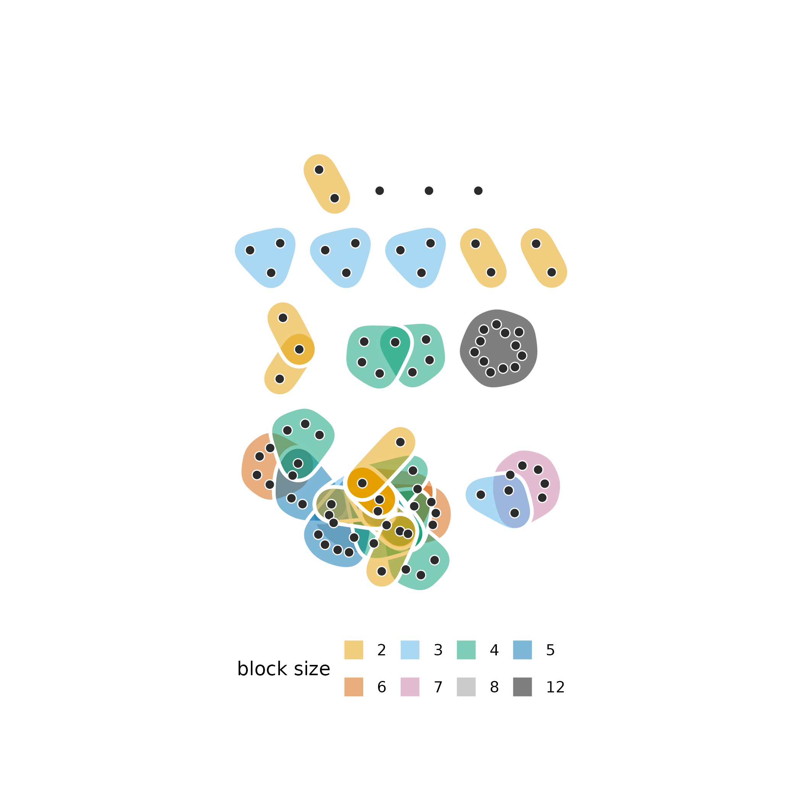

The blocks form 14 connected components. The largest joins 37 of the
cited decisions through 46 overlapping blocks, which share decisions
that the judgment cites in several passages. The other blocks lie apart,
and a decision cited in a block of its own is a point outside every
hull.

## Growth

The growth of a temporal hypergraph is the number of its nodes,
hyperedges and memberships at each time. With `mode = "cumulative"`,
each count includes everything that has appeared up to that time.

``` r

blocks_growth <- hg_growth(blocks, mode = "cumulative")
tail(blocks_growth, 3)
#>       time n_nodes n_edges n_edges_distinct n_memberships
#> 2024 25722    3615   46167            13505         77029
#> 2025 25748    3616   46173            13506         77051
#> 2026 25762    3618   46257            13539         77284
```

The figure plots the four counts against the date, Figure 4a of
Coupette, Hartung and Katz (2024).

``` r

plot(blocks_growth,
     columns = c("n_nodes", "n_edges", "n_edges_distinct", "n_memberships"))
```

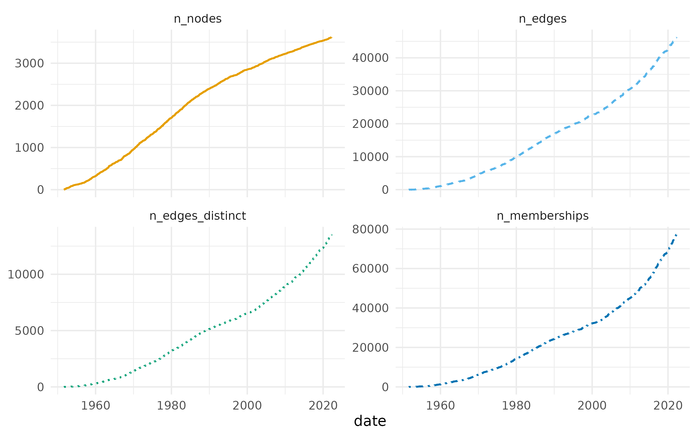

The number of decisions grows close to linearly over the seven decades,
and the numbers of blocks and memberships grow faster than linearly. At
the end of observation the 46,257 blocks hold 13,539 distinct sets of
decisions, 29% of their number.

The size of a block is the number of decisions it cites. The
distribution of block sizes is computed for the cumulative hypergraph at
five dates given in `at`.

``` r

census_dates <- as.Date(c("1960-12-31", "1975-12-31", "1990-12-31",
                          "2005-12-31", "2020-12-31"))
block_sizes <- hg_edges(blocks, what = "distribution", measure = "size",
                        at = census_dates, snapshot_mode = "cumulative")
```

The figure plots the complementary cumulative distribution of block size
at each date, Figure 4b of Coupette, Hartung and Katz (2024).

``` r

plot(block_sizes)
```

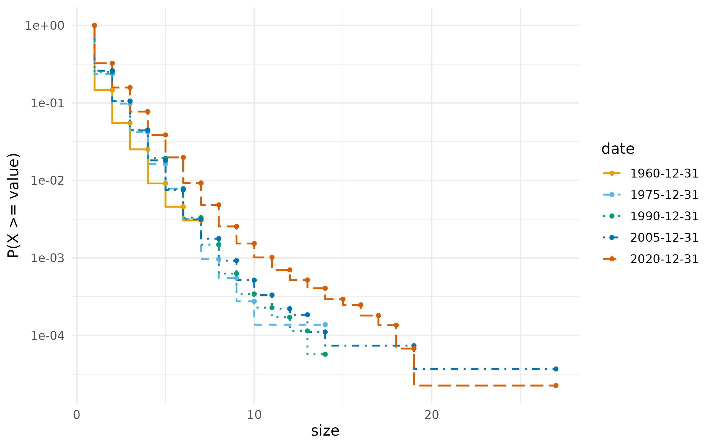

The curves move to the right over time. The largest block cited 7
decisions by the end of 1960 and 27 by the end of 2020, and the mean
size rose from 1.24 to 1.64.

## Arbitrators and tribunals over time

The hyperdegree of an arbitrator is the number of tribunals on which the
arbitrator sat.

``` r

hg_get(tribunals_all, what = "nodes", sort_by = "degree", top = 5)
#>                        node degree
#> 1            Brigitte STERN     94
#> 2    Stanimir A. ALEXANDROV     50
#> 3 Gabrielle KAUFMANN-KOHLER     43
#> 4           Zachary DOUGLAS     40
#> 5          Bernard HANOTIAU     37
tribunal_counts <- hg_measures(tribunals_all, what = "distribution",
                               measure = "hyperdegree")
```

The figure plots the complementary cumulative distribution of the
hyperdegree, Figure 5a of Coupette, Hartung and Katz (2024).

``` r

plot(tribunal_counts)
```

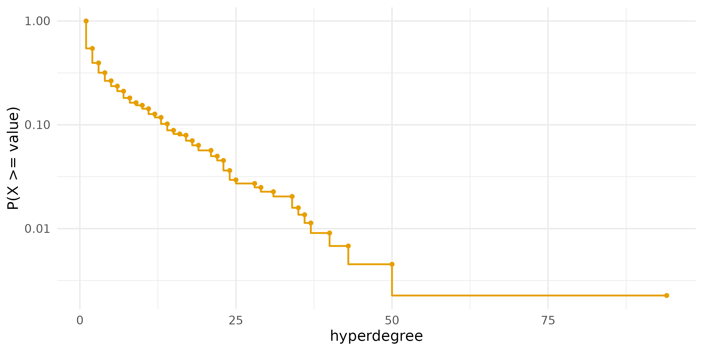

The distribution is heavy-tailed. Of the arbitrators, 61% sat on one or
two tribunals, and Brigitte STERN sat on 94, almost twice as many as the
next arbitrator, Stanimir A. ALEXANDROV, with 50.

For a hypergraph in the interval format, growth counts the active
hyperedges at each time, and the columns ending in `_cumulative` count
every hyperedge begun by that time. With `components = TRUE`, the number
of connected components of the active hypergraph, the share of its nodes
in the largest component and the diameter of that component are added.

``` r

tribunals_growth <- hg_growth(tribunals, components = TRUE)
tail(tribunals_growth, 3)
#>       time n_nodes n_edges n_edges_distinct n_memberships n_nodes_cumulative
#> 1074 17760     212     210              208           630                441
#> 1075 17777     212     209              207           627                441
#> 1076 17782     210     208              206           624                441
#>      n_edges_cumulative n_edges_distinct_cumulative n_components
#> 1074                742                         722            4
#> 1075                742                         722            4
#> 1076                742                         722            4
#>      largest_component diameter
#> 1074         0.9575472        7
#> 1075         0.9575472        7
#> 1076         0.9571429        7
```

The figure plots the active and cumulative counts of arbitrators and
tribunals, Figure 5b of Coupette, Hartung and Katz (2024).

``` r

plot(tribunals_growth,
     columns = c("n_nodes", "n_edges", "n_nodes_cumulative",
                 "n_edges_cumulative"),
     facets = FALSE)
```

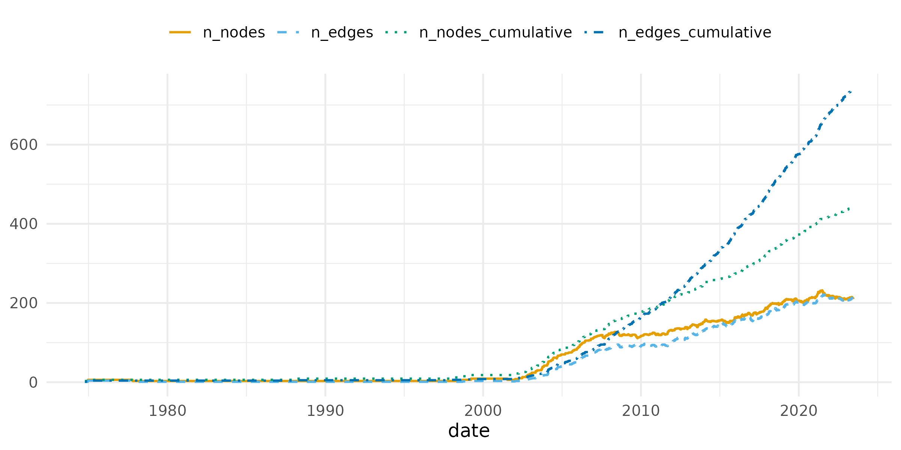

At the end of observation, 208 of the 742 tribunals were active, with
210 of the 441 arbitrators. The active counts stay close to zero until
2002 and rise steeply after it. Since 2007 the largest component has
held between 91% and 100% of the active arbitrators, and its diameter
has stayed between 6 and 9.

The neighbourhood of a tribunal is the set of arbitrators who share a
tribunal with one of its members. Its size is computed for every active
tribunal at every time, and `what = "summary"` returns its mean and
quartiles.

``` r

neighbourhood <- hg_edges(tribunals, what = "summary", measure = "n_neighbors")
```

The figure plots these summaries over time, Figure 5c of Coupette,
Hartung and Katz (2024).

``` r

plot(neighbourhood, columns = c("mean", "q25", "median", "q75"),
     facets = FALSE)
```

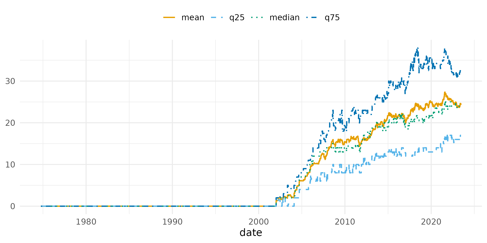

The mean and the median stay close together, so the size of a
neighbourhood has a symmetric distribution, unlike the hyperdegree of an
arbitrator. At the end of observation the median tribunal had 24
arbitrators in its neighbourhood.

## Repeated collaboration

A repeated collaboration is a pair or a set of three arbitrators who sit
together on more than one tribunal. The statistic `repeated_pairs` is
the number of pairs counted with their multiplicity minus the number of
distinct pairs, and `repeated_edges` is the number of tribunals whose
set of arbitrators sat before. A null model tells whether these counts
exceed what the number of tribunals of each arbitrator implies. In the
null model of Coupette, Hartung and Katz (2024), selected with
`method = "assignment"`, the arbitrators are taken in decreasing order
of hyperdegree, and each arbitrator is assigned to as many tribunals as
the arbitrator sat on, chosen at random among the tribunals with a free
seat. The model keeps the hyperdegree of every arbitrator and the size
of every tribunal. Its draws are not uniform over the hypergraphs with
these margins, and the test compares the observed count with 999 draws.

``` r

repeats <- hg_null_test(tribunals_all,
                        statistic = c("repeated_pairs", "repeated_edges"),
                        method = "assignment", n = 999, seed = 1)
repeats
#>        statistic observed  null_mean null_lo null_hi         z p_value   n
#> 1 repeated_pairs      357 299.438438     275     323  4.666061   0.001 999
#> 2 repeated_edges       20   2.612613       0       6 11.149553   0.001 999
#>       method
#> 1 assignment
#> 2 assignment
```

The tribunals contain 357 repeated pairs, against a null range of 275 to
323, and 20 repeated sets of three, against a null range of 0 to 6. Both
counts lie above every null draw. Arbitrators who sat together once sit
together again more often than their numbers of tribunals explain.

## Hyperedge centrality

The s-line graph of a hypergraph has one vertex per hyperedge, and two
vertices are adjacent when their hyperedges share at least *s* nodes.
The s-betweenness of a hyperedge is its betweenness centrality in the
s-line graph, the share of shortest paths between other hyperedges that
pass through it, and its s-closeness is the inverse of its mean distance
to the other hyperedges. With *s* = 1, two tribunals are adjacent when
they share an arbitrator. The centralities are computed on the tribunals
active at the end of observation, with the normalisation of NetworkX
that Coupette, Hartung and Katz (2024) use.

``` r

central_cases <- hg_edge_centrality(tribunals_active, s = 1,
                                    measure = "betweenness", top = 10)
central_cases
#>         edge s     measure      value
#> 1  ARB/17/21 1 betweenness 0.02654013
#> 2  ARB/19/27 1 betweenness 0.02499207
#> 3  ARB/18/23 1 betweenness 0.02262065
#> 4  ARB/16/20 1 betweenness 0.02213551
#> 5  ARB/20/19 1 betweenness 0.02206388
#> 6  ARB/18/43 1 betweenness 0.02137011
#> 7   ARB/21/5 1 betweenness 0.02136420
#> 8  ARB/20/53 1 betweenness 0.01910242
#> 9  ARB/20/13 1 betweenness 0.01904040
#> 10 ARB/16/39 1 betweenness 0.01796559
```

``` r

hg_edge_centrality(tribunals_active, s = 1, measure = "closeness", top = 10)
#>          edge s   measure     value
#> 1   ARB/18/23 1 closeness 0.4865949
#> 2   ARB/17/21 1 closeness 0.4772147
#> 3   ARB/20/19 1 closeness 0.4760676
#> 4   ARB/21/52 1 closeness 0.4715336
#> 5   ARB/16/39 1 closeness 0.4681894
#> 6    ARB/21/5 1 closeness 0.4616413
#> 7   ARB/22/20 1 closeness 0.4616413
#> 8   ARB/18/32 1 closeness 0.4605677
#> 9   ARB/19/27 1 closeness 0.4573767
#> 10 ADHOC/17/1 1 closeness 0.4552738
```

6 of the ten tribunals with the highest betweenness are also among the
ten with the highest closeness. With `edges`, the ten tribunals with the
highest betweenness are kept, and the figure plots them coloured by
economic sector, Figure 6a of Coupette, Hartung and Katz (2024).

``` r

central_tribunals <- hg_subset(tribunals_active, edges = central_cases)
```

``` r

plot(central_tribunals, color_by = "economic_sector",
     legend_title = "economic sector", label_size = 2.8)
```

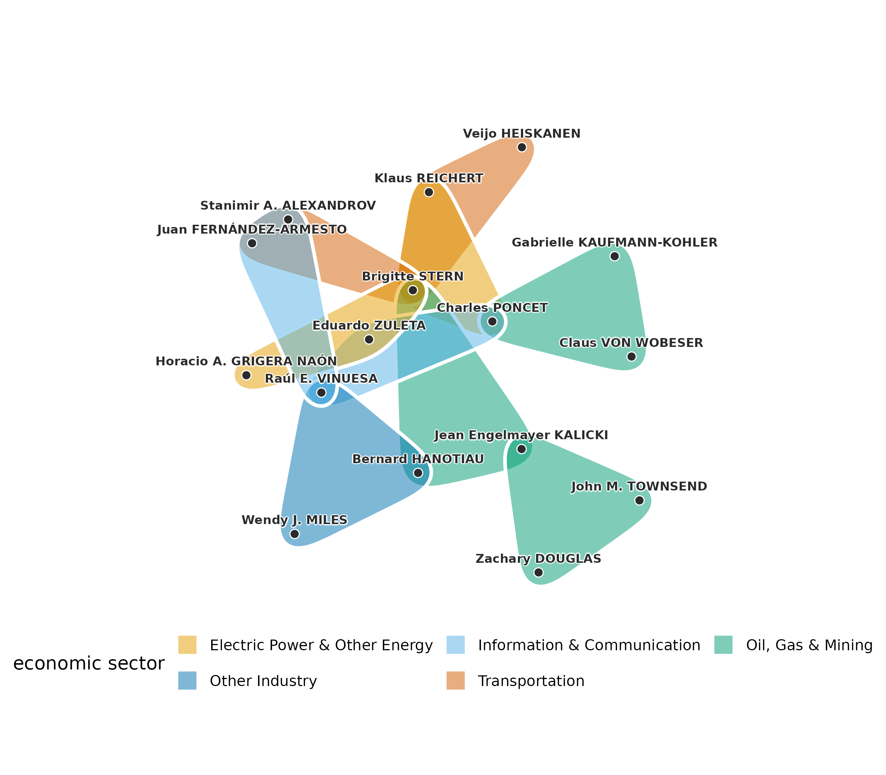

The central tribunals are joined through a few arbitrators who sit on
several of them. Brigitte STERN sits on 5 of the ten, and the tribunals
span 5 economic sectors.

## Motifs

A motif is a small pattern of hyperedges over a fixed number of nodes.
In a hypergraph whose hyperedges all have three nodes, four nodes can
hold up to four hyperedges, one for each set of three. The motif Y has
two of the four hyperedges, T has three and O has all four. A motif
count is compared with its distribution under a configuration model that
keeps the hyperdegree of every node and the size of every hyperedge,
sampled by repeated exchanges of members between pairs of hyperedges
(Lotito et al. 2023). The census is computed on the aggregate of all
tribunals, with 300 draws from the null model.

``` r

motifs <- hg_motifs(tribunals_all, n = 300, seed = 1)
motifs
#>   motif count    expected    null_sd        z     p_value     delta
#> 1     Y   478 291.6066667 20.3490857 9.159789 0.003322259 0.2409407
#> 2     T     7   0.7033333  0.8095197 7.778274 0.003322259 0.5380234
#> 3     O     0   0.0000000  0.0000000       NA 1.000000000 0.0000000
#>   normalized_delta n_null             method
#> 1        0.4087138    300 configuration_mcmc
#> 2        0.9126626    300 configuration_mcmc
#> 3        0.0000000    300 configuration_mcmc
```

The figure plots the null distribution of the count of Y with the
observed count, Figure 7c of Coupette, Hartung and Katz (2024).

``` r

plot(motifs)
```

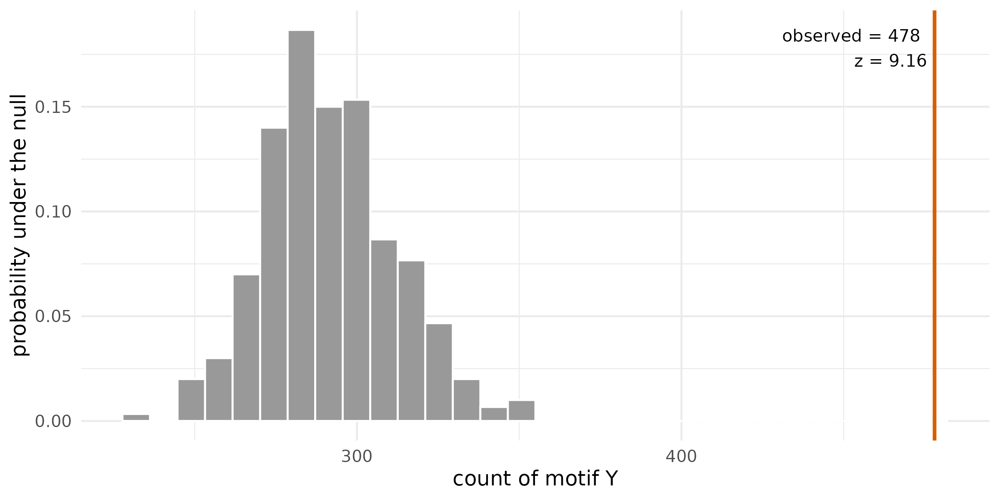

The tribunals contain 478 motifs Y against a null mean of 292 (z = 9.2)
and 7 motifs T against a null mean of 0.7. The motif O does not occur.
Two tribunals that share two arbitrators form a Y, so the excess of Y is
the repeated collaboration of pairs seen in the null-model test.

## Communities of arbitrators

A community is a set of nodes that share more hyperedges with each other
than with the rest of the hypergraph. Hypergraph modularity measures the
quality of a partition of the nodes into communities (Kamiński et
al. 2019). Let hyperedge *e* have size $`d_e`$ and weight $`w_e`$, and
let $`W = \sum_e w_e`$. For a partition, let $`c_e`$ be the largest
number of nodes of *e* in one community. The hyperedge is owned by that
community when $`c_e > d_e/2`$ and contributes $`w_e\,\omega(d_e, c_e)`$
to it. The linear weighting, $`\omega(d, c) = c/d`$, is the default
(Kamiński, Prałat and Théberge 2020). The expected owned weight of a
community *A* under a null model that keeps the weighted degree of every
node and the size of every hyperedge is its degree tax,

``` math
T_A = \sum_d W_d \sum_{c > d/2} \omega(d, c)\,
\binom{d}{c} p_A^{\,c} (1 - p_A)^{d-c},
```

where $`W_d`$ is the total weight of the hyperedges of size *d* and
$`p_A`$ is the share of the weighted degree held by *A*. The modularity
of the partition is

``` math
Q = \frac{1}{W}\Big(\sum_A E_A - \sum_A T_A\Big),
\qquad E_A = \sum_{e \text{ owned by } A} w_e\,\omega(d_e, c_e).
```

A partition with a single community has $`Q = 0`$. Iteratively
reweighted modularity maximisation (IRMM) finds a partition of high
modularity (Kumar et al. 2020). It maximises graph modularity on a
weighted clique expansion of the hypergraph with the Louvain method
(Blondel et al. 2008), raises the weight of the hyperedges that the
partition keeps whole relative to those it splits, and repeats until the
weights settle. The Louvain step is randomised, so IRMM is run from 20
seeds, and the partition reported is the medoid, the run with the
largest summed adjusted mutual information with the other runs (Vinh,
Epps and Bailey 2010). Modularity cannot resolve communities below a
size set by the total weight (Fortunato and Barthélemy 2007), and runs
from different seeds reach different partitions of similar modularity,
so the agreement between runs is part of the result.

``` r

irmm <- hg_communities(tribunals_all, type = "irmm", seeds = 1:20,
                       n_runs = 20, max_iter = 300)
irmm
#> Hypergraph IRMM communities: 441 nodes, 15 communities (the medoid of 20 runs, run 10, seed 10)
#>                     node community
#>    Abdulqawi Ahmed YUSUF         1
#>          Achille NGWANZA         2
#>           Adolfo JIMÉNEZ         3
#>   Ahmed Sadek EL-KOSHERI         4
#>    Aimery DE SCHOUTHEETE         5
#>          Aktham EL KHOLY         2
#>             Alain PELLET         6
#>           Alain VIANDIER         7
#>  Albert Jan VAN DEN BERG         6
#>        Alejandro ESCOBAR         2
#> ... 431 more rows
```

The medoid has 15 communities of between 3 and 79 arbitrators. All 20
runs converged, with between 13 and 17 communities, and two runs agree
with a median adjusted mutual information of 0.55. The modularity of the
medoid is computed for the hypergraph.

``` r

irmm_modularity <- hg_modularity(tribunals_all, irmm)
irmm_modularity
#>     type modularity edge_contribution degree_tax n_communities n_edges
#> 1 linear  0.3491433         0.6042228  0.2550796            15     742
#>   total_weight
#> 1          742
```

The medoid owns a weighted share of 0.60 of the tribunals against a
degree tax of 0.26, for a modularity of 0.349. The runs reach
modularities between 0.341 and 0.370. The contribution of each community
shows where the score comes from.

``` r

hg_modularity(tribunals_all, irmm, what = "communities")
#>    community n_nodes volume edge_contribution   degree_tax  modularity
#> 1          3      79    426       0.125786164 6.623957e-02 0.059546596
#> 2          5      64    374       0.103773585 5.171481e-02 0.052058773
#> 3          6      57    448       0.119946092 7.285756e-02 0.047088533
#> 4          1      51    229       0.062893082 2.007782e-02 0.042815261
#> 5          2      42    177       0.046720575 1.214247e-02 0.034578101
#> 6          4      40    226       0.053459119 1.956910e-02 0.033890018
#> 7          9      28     88       0.025606469 3.063900e-03 0.022542569
#> 8          8      30    121       0.027852650 5.748883e-03 0.022103768
#> 9          7      25     94       0.022012579 3.491142e-03 0.018521437
#> 10        10       7     15       0.004492363 9.050998e-05 0.004401853
#> 11        13       3      9       0.004043127 3.262765e-05 0.004010499
#> 12        14       6     10       0.003593890 4.027199e-05 0.003553618
#> 13        11       3      3       0.001347709 3.630191e-06 0.001344079
#> 14        12       3      3       0.001347709 3.630191e-06 0.001344079
#> 15        15       3      3       0.001347709 3.630191e-06 0.001344079
```

The largest communities contribute most of the score. The 4 communities
of three arbitrators are the small components of the hypergraph,
tribunals whose arbitrators never sat with anyone else.

The figure plots the ten central tribunals of the previous section with
each arbitrator coloured and shaped by its IRMM community.

``` r

plot(central_tribunals, node_groups = irmm, label_size = 2.8)
```

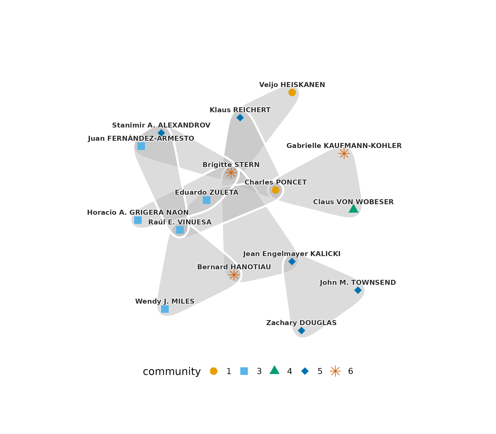

The 16 arbitrators of the central tribunals belong to 5 communities, and
9 of the ten tribunals join arbitrators of more than one community. A
tribunal that is central in the line graph connects parts of the
hypergraph that modularity separates.

Infomap partitions a graph by minimising the description length of a
random walk on it (Rosvall and Bergstrom 2008). The default method of
[`hg_communities()`](https://mohsaqr.github.io/hypergraphs/reference/hg_communities.md)
runs Infomap on the association graph of the hypergraph, in which a
hyperedge of size *d* adds $`1/(d-1)`$ to the weight of each pair of its
members, following Coupette, Hartung and Katz (2024).

``` r

infomap <- hg_communities(tribunals_all, seeds = 1:20, n_runs = 20)
hg_modularity(tribunals_all, infomap)
#>     type modularity edge_contribution degree_tax n_communities n_edges
#> 1 linear  0.1274398         0.8948787  0.7674389            59     742
#>   total_weight
#> 1          742
```

The Infomap medoid has 59 communities, and its largest holds 217
arbitrators. It owns more of the tribunals than the IRMM medoid, with an
edge contribution of 0.89, and pays a larger degree tax, 0.77, for a
modularity of 0.127. Two Infomap runs agree with a median adjusted
mutual information of 0.98. The two partitions are compared directly.

``` r

hg_agreement(irmm, infomap, method = c("ari", "ami"))
#>     n  agreement aligned        ari       ami
#> 1 441 0.09977324     239 0.05325693 0.3334312
```

The adjusted Rand index between the two medoids is 0.05 and the adjusted
mutual information 0.33. Infomap keeps 217 arbitrators of the densely
connected core in one community, because a random walk remains in the
core for long periods, and IRMM divides the arbitrators among
communities of at most 79. The two objectives give different partitions
of the same tribunals.

## Communities of decisions across representations

Coupette, Hartung and Katz (2024) partition the GFCC decisions in eight
representations and compare the partitions. Four are citation graphs,
binary (`bg`) or with multiplicities (`mg`), directed or undirected
(`bgu`, `mgu`). Four are association graphs of the hypergraph, binary
(`bh`) or with multiplicities (`mh`), with (`bhs`, `mhs`) or without
self-association, the term that joins the citing decision to the
decisions of its block. The partitions use the backward citations, those
whose citing decision is later than the cited one.

``` r

backward_citations <- subset(gfcc_citations, date_citing > date_cited)
backward <- temporal_hypergraph(backward_citations, node = "cited",
                                hyperedge = "block", time = "date_citing",
                                nodes = gfcc_decisions, sparse = TRUE)
backward_all <- hg_snapshot(backward, mode = "cumulative")
```

Each representation is partitioned by Infomap from five seeds with five
trials each. The original analysis uses 50 seeds with 100 trials. The
citation graphs are selected with `method = "citation"`, the binary
representations with `duplicate_edges = "collapse"`, and
self-association with `self_association = TRUE`.

``` r

communities_bg <- hg_communities(backward_all, n_runs = 5, trials = 5,
                                 seeds = 1:5, method = "citation",
                                 edge_source = "citing",
                                 duplicate_edges = "collapse", directed = TRUE)
communities_bgu <- hg_communities(backward_all, n_runs = 5, trials = 5,
                                  seeds = 1:5, method = "citation",
                                  edge_source = "citing",
                                  duplicate_edges = "collapse")
communities_mg <- hg_communities(backward_all, n_runs = 5, trials = 5,
                                 seeds = 1:5, method = "citation",
                                 edge_source = "citing", directed = TRUE)
communities_mgu <- hg_communities(backward_all, n_runs = 5, trials = 5,
                                  seeds = 1:5, method = "citation",
                                  edge_source = "citing")
```

``` r

communities_bh <- hg_communities(backward_all, n_runs = 5, trials = 5,
                                 seeds = 1:5, duplicate_edges = "collapse")
communities_bhs <- hg_communities(backward_all, n_runs = 5, trials = 5,
                                  seeds = 1:5, duplicate_edges = "collapse",
                                  self_association = TRUE,
                                  edge_source = "citing")
communities_mh <- hg_communities(backward_all, n_runs = 5, trials = 5,
                                 seeds = 1:5)
communities_mhs <- hg_communities(backward_all, n_runs = 5, trials = 5,
                                  seeds = 1:5, self_association = TRUE,
                                  edge_source = "citing")
```

The eight partitions are set side by side. With `hg`, each medoid is
also scored on the graph it was computed on. The quality measures are
defined on undirected graphs, so the two directed citation fits (`bg`,
`mg`) get no score and the comparison warns about them.

``` r

comparison <- hg_compare_communities(
  bg = communities_bg, bgu = communities_bgu, mg = communities_mg,
  mgu = communities_mgu, bh = communities_bh, bhs = communities_bhs,
  mh = communities_mh, mhs = communities_mhs,
  hg = backward_all
)
#> Warning: fit(s) `bg`, `mg` ran on a directed citation graph; the quality scores
#> are defined on undirected projections, so their quality row is NA.
comparison
#> Community comparison across 8 representations: bg, bgu, mg, mgu, bh, bhs, mh, mhs
#>  model medoid_seed n_runs n_communities n_singletons n_nontrivial largest_size
#>     bg           1      5           362          221          141          284
#>    bgu           1      5           330          216          114          363
#>     mg           2      5           416          229          187           96
#>    mgu           5      5           404          216          188          132
#>     bh           2      5           874          664          210          120
#>    bhs           5      5           421          216          205          101
#>     mh           4      5           902          664          238           63
#>    mhs           2      5           450          216          234          102
#>  second_size   balance
#>          135 0.4753521
#>          190 0.5234160
#>           94 0.9791667
#>           92 0.6969697
#>           91 0.7583333
#>           89 0.8811881
#>           62 0.9841270
#>           87 0.8529412
```

The association graphs without self-association leave 664 (`bh`) and 664
(`mh`) decisions as singletons, the decisions that no later decision
cites. With self-association a citing decision is joined to the
decisions it cites, and the number of singletons falls to 216 (`bhs`),
close to the 221 of the binary citation graph. The figure plots the
distribution of community sizes in the eight partitions, Figure 8b of
Coupette, Hartung and Katz (2024).

``` r

plot(comparison)
```

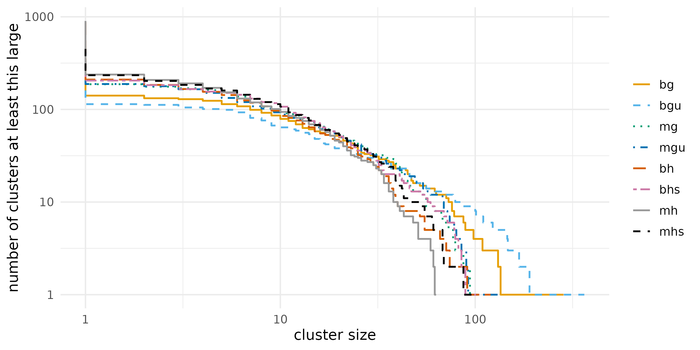

The curves are close between sizes of about 3 and 30 and differ at both
ends. The partitions without self-association have the most singletons,
and the binary citation graphs have the largest communities, of 284
(`bg`) and 363 (`bgu`) decisions, against 63 for `mh`. The similarity
between two partitions is measured by the adjusted mutual information
and the adjusted Rand index.

``` r

plot(comparison, what = "similarity")
```

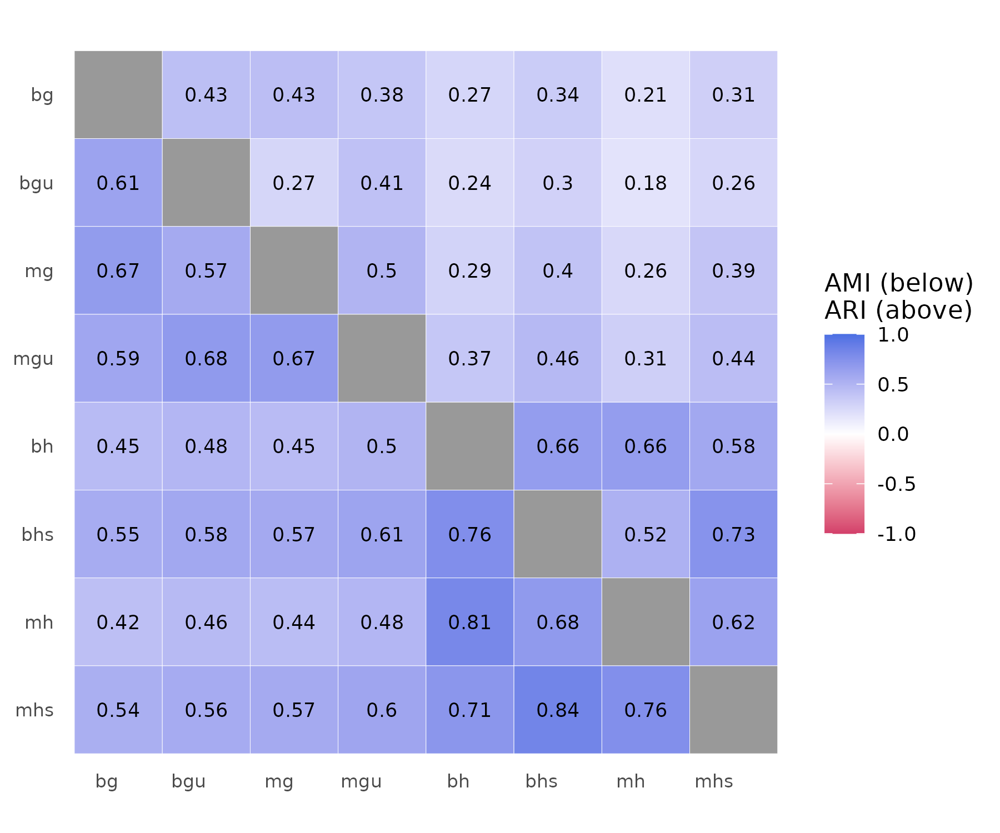

The figure shows the adjusted mutual information below the diagonal and
the adjusted Rand index above it, Figure 8c of Coupette, Hartung and
Katz (2024). Partitions of two hypergraph representations agree with a
mean adjusted mutual information of 0.76, and a partition of a
hypergraph representation agrees with a partition of a citation graph
with a mean of 0.52. The quality of each medoid is measured on its own
graph by coverage, performance, modularity and the largest conductance
of a community.

``` r

hg_get(comparison, what = "quality")
#>   model  coverage weighted_coverage performance modularity conductance
#> 1    bg        NA                NA          NA         NA          NA
#> 2   bgu 0.4713374         0.4713374   0.9725865  0.4197613   0.8881988
#> 3    mg        NA                NA          NA         NA          NA
#> 4   mgu 0.3582378         0.5497558   0.9874580  0.5251639   0.8372881
#> 5    bh 0.4344190         0.5914135   0.9924775  0.5680416   0.7711864
#> 6   bhs 0.3167942         0.5720922   0.9879647  0.5521826   0.8374632
#> 7    mh 0.3769212         0.6147573   0.9937396  0.5950959   0.8333333
#> 8   mhs 0.2904028         0.6090068   0.9887366  0.5882855   0.8590284
#>   n_communities
#> 1            NA
#> 2           330
#> 3            NA
#> 4           404
#> 5           874
#> 6           421
#> 7           902
#> 8           450
```

The medoids of the hypergraph representations reach a graph modularity
between 0.55 and 0.60 on their own graphs, and those of the undirected
citation graphs between 0.42 and 0.53. Each score is computed on a
different graph, so the comparison describes how clearly each
representation divides into communities and does not rank the partitions
on a common scale.

## Interpretation

The hypergraph and the graph built from the same data describe the nodes
differently. An arbitrator sits on a median of 2 tribunals but has a
median of 4 colleagues, and repeated sets of colleagues, which the graph
merges, exceed a null model that keeps every arbitrator’s number of
tribunals. The excess of the motif Y is the same repetition seen in
groups of four arbitrators. The central tribunals and the communities
answer different questions. The central tribunals sit between
communities, and the partitions of the core of the hypergraph depend on
the objective, modularity or description length. For the court, the
partitions of the four hypergraph representations resemble each other
more than they resemble the partitions of the citation graphs.

## Limitations

The data end on 15 June 2023, and the tribunals pending on that date are
treated as active until then, so the active snapshot at the end of
observation includes cases of unknown length. The null model of the
repeated-collaboration test draws hypergraphs with the correct margins
but not uniformly among them. The motif census uses 300 draws and the
GFCC partitions five seeds with five trials, against 1,000 draws and 50
seeds with 100 trials in the original analysis, so the tails of the null
distributions and the medoids are estimated with less precision.
Hypergraph modularity counts a hyperedge for a community only when a
majority of its nodes belong to that community, so for tribunals of
three arbitrators a tribunal split two to one counts as owned. Both
community methods are randomised, and a single run is not a finding.

## References

Blondel, V. D., Guillaume, J.-L., Lambiotte, R., & Lefebvre, E. (2008).
Fast unfolding of communities in large networks. *Journal of Statistical
Mechanics: Theory and Experiment*, 2008(10), P10008.
<https://doi.org/10.1088/1742-5468/2008/10/P10008>

Coupette, C., Hartung, D., & Katz, D. M. (2024). Legal hypergraphs.
*Philosophical Transactions of the Royal Society A*, 382(2270),
20230141. <https://doi.org/10.1098/rsta.2023.0141>

Fortunato, S., & Barthélemy, M. (2007). Resolution limit in community
detection. *Proceedings of the National Academy of Sciences*, 104(1),
36–41. <https://doi.org/10.1073/pnas.0605965104>

Kamiński, B., Poulin, V., Prałat, P., Szufel, P., & Théberge, F. (2019).
Clustering via hypergraph modularity. *PLOS ONE*, 14(11), e0224307.
<https://doi.org/10.1371/journal.pone.0224307>

Kamiński, B., Prałat, P., & Théberge, F. (2020). Community detection
algorithm using hypergraph modularity. In *Complex Networks & Their
Applications IX*, Studies in Computational Intelligence 943, 152–163.
<https://doi.org/10.1007/978-3-030-65347-7_13>

Kumar, T., Vaidyanathan, S., Ananthapadmanabhan, H., Parthasarathy, S.,
& Ravindran, B. (2020). Hypergraph clustering by iteratively reweighted
modularity maximization. *Applied Network Science*, 5, 52.
<https://doi.org/10.1007/s41109-020-00300-3>

Lotito, Q. F., Contisciani, M., De Bacco, C., Di Gaetano, L., Gallo, L.,
Montresor, A., Musciotto, F., Ruggeri, N., & Battiston, F. (2023).
Hypergraphx: a library for higher-order network analysis. *Journal of
Complex Networks*, 11(3), cnad019.

Rosvall, M., & Bergstrom, C. T. (2008). Maps of random walks on complex
networks reveal community structure. *Proceedings of the National
Academy of Sciences*, 105(4), 1118–1123.
<https://doi.org/10.1073/pnas.0706851105>

Vinh, N. X., Epps, J., & Bailey, J. (2010). Information theoretic
measures for clusterings comparison: Variants, properties, normalization
and correction for chance. *Journal of Machine Learning Research*, 11,
2837–2854.
