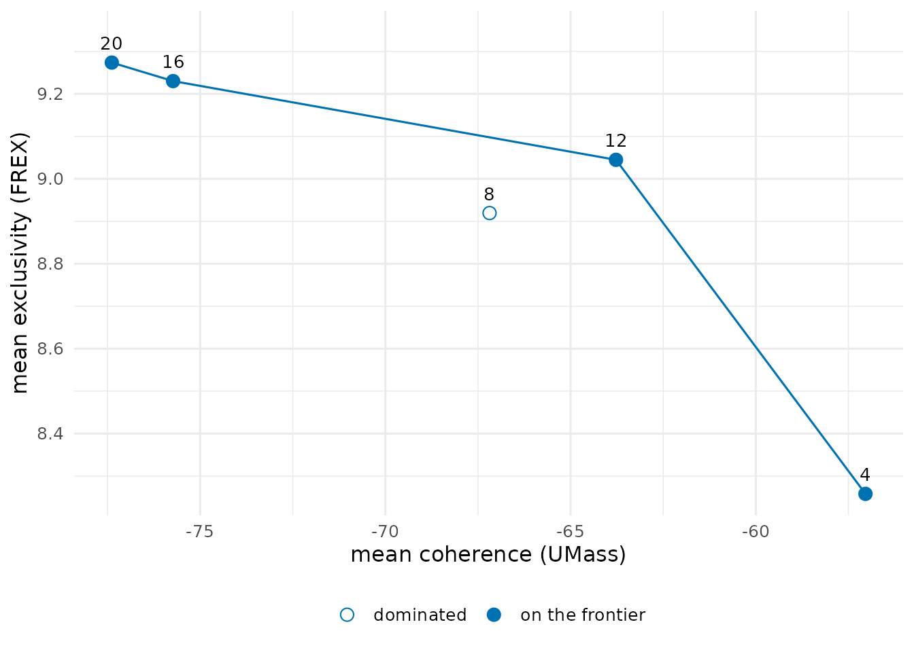
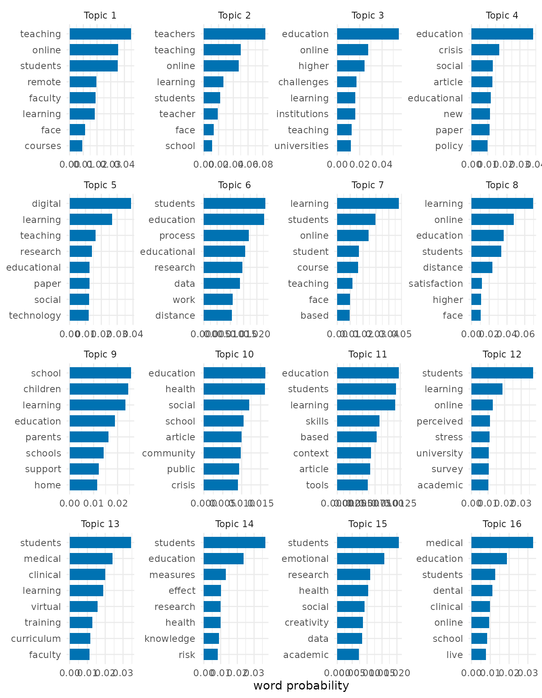
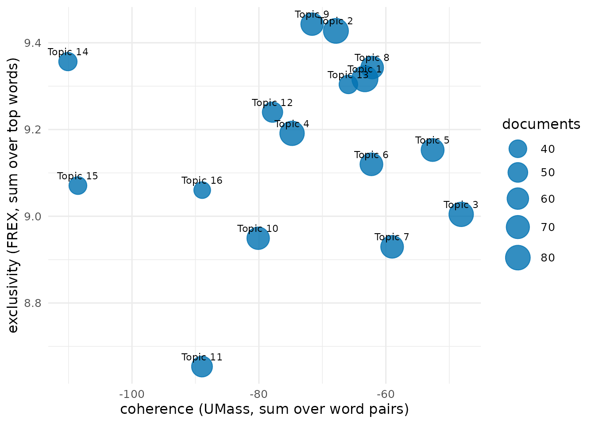
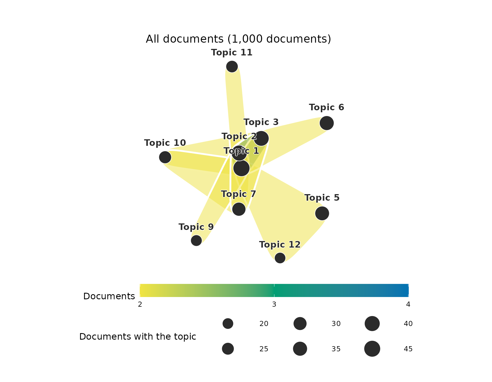
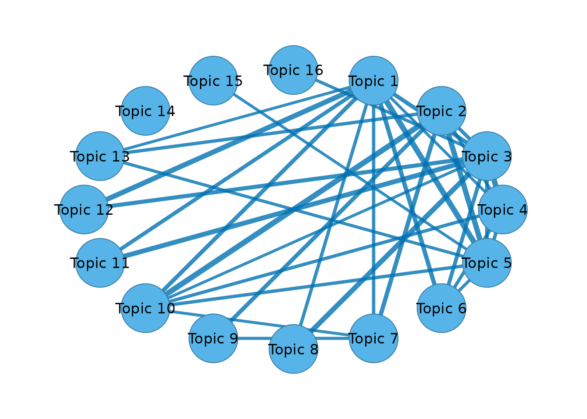

# Mixed-membership topics of the COVID-19 education literature

A topic model describes a corpus by a small number of themes. Each
theme, or topic, is a probability distribution over the words of the
vocabulary, and each document is a mixture of topics in proportions of
its own. An abstract on the online teaching of medical students draws on
a topic about online teaching and on a topic about medical education,
and it belongs to both in the proportions its words indicate. A
partition, in which every document belongs to exactly one topic, is the
special case of documents that are each about one thing. The shares of a
mixed-membership model show how close a corpus comes to that case.

## The corpus

`covid_sample` holds a random sample of 1,000 abstracts of research on
COVID-19 and education published from 2020 to 2024.
[`clean_text()`](https://pak.dynasite.org/hypergraphs/reference/clean_text.md)
removes what a bibliographic export adds to an abstract, such as HTML,
citation numbers in brackets, URLs and copyright notices. The stop list
is
[`stop_words_en()`](https://pak.dynasite.org/hypergraphs/reference/stop_words_en.md)
together with the words that name the subject of every abstract, since a
word that occurs in every document separates none of them.

``` r

abstracts <- clean_text(covid_sample, column = "abstract")
boilerplate <- c("covid", "coronavirus", "sars", "cov", "pandemic",
                 "disease", "study", "studies", "result", "results",
                 "conclusion", "conclusions", "background", "method",
                 "methods", "objective", "aim")
stops <- c(stop_words_en(), boilerplate)
```

## The hypergraph

Each abstract is a node, and each word that occurs at least five times
in the corpus is a hyperedge that binds the abstracts using it. The
incidence of an abstract and a word is the count of the word in the
abstract. The incidence matrix is stored dense (`sparse = FALSE`), which
the graded memberships at the end require.

``` r

abstracts_hg <- text_hypergraph(abstracts, column = "abstract", id = "doc",
                                stop_words = stops, min_count = 5,
                                min_chars = 2, sparse = FALSE)
abstracts_hg
#> Text hypergraph: 1000 documents, 3206 words (documents as nodes, weight = n)
#> Hyperedges: 3206 (words); sizes 1-688, median 10
#>                 doc       word count weight
#>  2-s2.0-85082857029   addition     1      1
#>  2-s2.0-85082857029   although     1      1
#>  2-s2.0-85082857029    attempt     1      1
#>  2-s2.0-85082857029      basic     1      1
#>  2-s2.0-85082857029 beneficial     1      1
#>  2-s2.0-85082857029     bridge     1      1
#>  2-s2.0-85082857029       care     1      1
#>  2-s2.0-85082857029    centers     1      1
#>  2-s2.0-85082857029  challenge     1      1
#>  2-s2.0-85082857029    changes     1      1
#> ... 73167 more rows
```

The hypergraph has 1000 abstracts and 3,206 words.

## How many topics

A topic model has as many topics as it is given, and no statistic
identifies the correct number. Two properties of the topics guide the
choice. Semantic coherence measures how often the most probable words of
a topic occur in the same documents (Mimno et al. 2011). For every pair
of top words it takes the logarithm of the number of documents
containing both, plus one, divided by the number of documents containing
the more probable word, and it sums these values over the pairs. Values
closer to zero are more coherent. Exclusivity measures how far the top
words of a topic belong to that topic rather than to the others. FREX
combines, for every top word, the rank of its probability within the
topic and the rank of its share of the probability it has across all
topics, and sums these over the top words (Bischof & Airoldi 2012).
Models with fewer topics have broader, more coherent topics, and models
with more topics have narrower, more exclusive ones. A number of topics
is worth considering when no other number gives both a higher coherence
and a higher exclusivity, and these numbers form the frontier of the two
measures (Roberts et al. 2014).

[`hg_topic_search()`](https://pak.dynasite.org/hypergraphs/reference/hg_topic_search.md)
fits the topic model of the next section for 4, 8, 12, 16 and 20 topics,
each from two random starts, and reports the mean coherence and the mean
exclusivity of the ten most probable words of the topics.

``` r

topic_search <- hg_topic_search(abstracts_hg, k = seq(4, 20, by = 4),
                                nstart = 2, parallel = TRUE, n_cores = 2)
topic_search
#>    k coherence exclusivity divergence agreement converged frontier
#> 1  4 -57.04019    8.258057   273341.7 0.6460459      TRUE     TRUE
#> 2  8 -67.18732    8.919377   258924.3 0.5405804      TRUE    FALSE
#> 3 12 -63.77484    9.044799   249191.7 0.4270125      TRUE     TRUE
#> 4 16 -75.73072    9.230223   241968.0 0.4122055      TRUE     TRUE
#> 5 20 -77.38563    9.273786   235778.3 0.4196326      TRUE     TRUE
```

``` r

plot(topic_search)
```



Mean coherence falls from -57 with 4 topics to -75.7 with 16 and -77.4
with 20, and mean exclusivity rises from 8.26 to 9.23 and 9.27. The
models with 4, 12, 16 and 20 topics lie on the frontier. Sixteen topics
is the number of the published structural topic model of this literature
(Saqr et al. 2023), and the model below uses it.

## A mixed-membership model of 16 topics

[`hg_topics()`](https://pak.dynasite.org/hypergraphs/reference/hg_topics.md)
approximates the matrix of word counts, with one row per abstract and
one column per word, by the product of two non-negative matrices. The
first gives every abstract a weight on every topic, and the second gives
every topic a weight on every word. The fit minimises the
Kullback-Leibler divergence between the counts and their approximation
by the multiplicative updates of Lee and Seung (2001). With this
divergence the factorization is the maximum-likelihood fit of
probabilistic latent semantic analysis (Hofmann 1999; Gaussier & Goutte
2005). After normalisation, the weights of an abstract are its shares of
the topics, which sum to one, and the weights of a topic are the
probabilities of its words.

The fit depends on its random start. It is run from five starts, and the
start with the smallest divergence is kept. The agreement of a topic is
the average Jaccard coefficient of its first one, two, and up to ten
most probable words with those of the matching topic of another start,
the topics of two starts being paired by the Hungarian method (Kuhn
1955; Greene et al. 2014). A topic whose agreement is close to one is
found again from every start.

``` r

topic_model <- hg_topics(abstracts_hg, k = 16, nstart = 5, parallel = TRUE,
                         n_cores = 2)
topic_model
#> Topic model (KL factorization): 16 topics, 1000 documents, 3206 words; best of 5 starts (divergence 241567, converged)
#>     topic prevalence documents agreement
#>   Topic 1 0.08928459  89.28459 0.4701659
#>   Topic 2 0.08170103  81.70103 0.5401220
#>   Topic 3 0.07823106  78.23106 0.3416270
#>   Topic 4 0.07808382  78.08382 0.4845528
#>   Topic 5 0.06831896  68.31896 0.3269328
#>   Topic 6 0.06743098  67.43098 0.4000271
#>   Topic 7 0.06704091  67.04091 0.5148371
#>   Topic 8 0.06659078  66.59078 0.5168540
#>   Topic 9 0.06592187  65.92187 0.7267678
#>  Topic 10 0.06571205  65.71205 0.3998778
#>                                            top_words
#>          teaching, online, students, remote, faculty
#>       teachers, teaching, online, learning, students
#>      education, online, higher, challenges, learning
#>      education, crisis, social, article, educational
#>   digital, learning, teaching, research, educational
#>  students, education, process, educational, research
#>          learning, students, online, student, course
#>      learning, online, education, students, distance
#>       school, children, learning, education, parents
#>           education, health, social, school, article
#> ... 6 more rows
```

The prevalence of a topic is its mean share over the abstracts, and its
documents column is the sum of those shares, the expected number of
abstracts it accounts for. The largest topic, led by teaching, online,
students, remote, faculty, accounts for 8.9% of the corpus, and the
smallest, led by medical, education, students, dental, clinical, for
3.5%. The mean agreement of the topics across the starts is 0.43. Topics
with a low agreement are one of several divisions of their part of the
vocabulary that the data support about equally well.

``` r

plot(topic_model)
```



## How mixed the abstracts are

The largest share of an abstract identifies its main topic.

``` r

main_topics <- hg_get(topic_model, what = "documents")
head(main_topics)
#>                 node    topic     share
#> 1 2-s2.0-85082857029 Topic 16 0.6736757
#> 2 2-s2.0-85083678184  Topic 4 0.3823343
#> 3 2-s2.0-85085340620 Topic 13 0.2170913
#> 4 2-s2.0-85085481629  Topic 4 0.5309569
#> 5 2-s2.0-85085656133 Topic 15 0.5887669
#> 6 2-s2.0-85085770267  Topic 5 0.5625973
```

In the median abstract the main topic has a share of 0.55, and half the
abstracts lie between 0.4 and 0.73. 11.7% of the abstracts have a main
topic with a share of 0.9 or more, and 42.5% have no topic with a share
above one half. Most abstracts combine topics.

The shares of a single abstract show the mixture.

``` r

shares <- hg_get(topic_model, what = "shares")
example_shares <- subset(shares, node == "2-s2.0-85101300775" & share >= 0.05)
example_shares
#>                    node    topic share
#> 3933 2-s2.0-85101300775 Topic 13     1
```

``` r

example_abstract <- subset(abstracts, doc == "2-s2.0-85101300775")
with(example_abstract, writeLines(strwrap(abstract, 78)))
#> As COVID-19 necessitated student removal from clinical environments, a
#> virtual curriculum involving existing and novel clerkship elements was
#> developed that utilized near peers for both teaching and feedback. Shelf
#> scores, engagement, and satisfaction demonstrated success of these new
#> curricular elements, many of which will be incorporated for future students.
```

The abstract describes near-peer teaching in a medical course moved
online. It takes a share of 1 of the topic led by students, medical,
clinical, learning, virtual and NA of the topic led by . A partition
would assign it to one of the two and lose the other half of what it is
about.

## Topic quality

[`hg_topic_quality()`](https://pak.dynasite.org/hypergraphs/reference/hg_topic_quality.md)
scores every topic by the same coherence and exclusivity. The size of a
topic is its expected number of abstracts.

``` r

model_quality <- hg_topic_quality(abstracts_hg, topics = topic_model)
model_quality
#>       topic     size n_words  coherence exclusivity coherence_type
#> 1   Topic 1 89.28459      10  -63.29858    9.317035          umass
#> 2   Topic 2 81.70103      10  -67.86600    9.427454          umass
#> 3   Topic 3 78.23106      10  -48.12967    9.004363          umass
#> 4   Topic 4 78.08382      10  -74.77638    9.191168          umass
#> 5   Topic 5 68.31896      10  -52.63135    9.152760          umass
#> 6   Topic 6 67.43098      10  -62.27314    9.119797          umass
#> 7   Topic 7 67.04091      10  -59.01273    8.929498          umass
#> 8   Topic 8 66.59078      10  -62.15559    9.342915          umass
#> 9   Topic 9 65.92187      10  -71.61741    9.442916          umass
#> 10 Topic 10 65.71205      10  -80.11552    8.949298          umass
#> 11 Topic 11 55.93086      10  -88.96585    8.653444          umass
#> 12 Topic 12 53.36061      10  -77.85715    9.240048          umass
#> 13 Topic 13 44.18119      10  -65.90307    9.303953          umass
#> 14 Topic 14 42.86529      10 -110.09596    9.356549          umass
#> 15 Topic 15 40.25358      10 -108.51756    9.070723          umass
#> 16 Topic 16 35.09241      10  -88.93457    9.060258          umass
#>    exclusivity_type
#> 1              frex
#> 2              frex
#> 3              frex
#> 4              frex
#> 5              frex
#> 6              frex
#> 7              frex
#> 8              frex
#> 9              frex
#> 10             frex
#> 11             frex
#> 12             frex
#> 13             frex
#> 14             frex
#> 15             frex
#> 16             frex
```

``` r

plot(model_quality)
```



## Topic combinations

An abstract draws on several topics at once, and the topics it combines
form a set. A network of topics keeps only the pairs of such a set. A
hypergraph keeps the whole set, with every topic as a node and every
combination of topics that occurs in the abstracts as a hyperedge.

[`group_hypergraph()`](https://pak.dynasite.org/hypergraphs/reference/group_hypergraph.md)
builds this hypergraph from the topic model. A topic counts as present
in an abstract when its share is at least a threshold, as in the topic
networks of Abuhay et al. (2017) and Cassi et al. (2017), and the set of
an abstract is the topics present in it. The threshold here is 0.2, a
little over three times the even share of 1/16. `min_size = 2` keeps the
abstracts that combine two or more topics, and `top = Inf` keeps every
combination.

``` r

topic_sets <- group_hypergraph(topic_model, threshold = 0.2, min_size = 2,
                               top = Inf)
combinations <- hg_get(topic_sets, what = "sets")
head(combinations)
#>           group           hyperedge                 set size count share
#> 1 All documents   Topic 1 + Topic 7   Topic 1 + Topic 7    2    16 0.016
#> 2 All documents   Topic 1 + Topic 2   Topic 1 + Topic 2    2    14 0.014
#> 3 All documents   Topic 3 + Topic 5   Topic 3 + Topic 5    2    14 0.014
#> 4 All documents   Topic 1 + Topic 6   Topic 1 + Topic 6    2    12 0.012
#> 5 All documents Topic 10 + Topic 11 Topic 10 + Topic 11    2    10 0.010
#> 6 All documents  Topic 2 + Topic 12  Topic 2 + Topic 12    2    10 0.010
```

At this threshold 63.8% of the abstracts combine two or more topics, in
226 distinct combinations. The proportion depends on the threshold. With
0.1 it is 85.8%, and with 0.3 it is 23.9%, so a count of combinations is
reported together with its threshold. The eight most frequent
combinations of three or more topics are plotted below. Every
combination is a pebble around its topics, coloured by the number of
abstracts that carry it, and every topic is a circle whose area is the
number of these abstracts that contain it.

``` r

frequent_triples <- group_hypergraph(topic_model, threshold = 0.2,
                                     min_size = 3, top = 8)
plot(frequent_triples, group = "All documents")
```



`by =` counts the combinations within a column of the documents table,
such as the publication year.

``` r

sets_by_year <- group_hypergraph(topic_model, threshold = 0.2, min_size = 2,
                                 group = "year", top = 2)
hg_get(sets_by_year, what = "sets")
#>   group                hyperedge                set size count      share
#> 1  2020  2020: Topic 1 + Topic 7  Topic 1 + Topic 7    2     5 0.02808989
#> 2  2020  2020: Topic 4 + Topic 5  Topic 4 + Topic 5    2     5 0.02808989
#> 3  2021  2021: Topic 3 + Topic 5  Topic 3 + Topic 5    2    12 0.01854714
#> 4  2021  2021: Topic 1 + Topic 7  Topic 1 + Topic 7    2    11 0.01700155
#> 5  2022  2022: Topic 1 + Topic 2  Topic 1 + Topic 2    2     3 0.02097902
#> 6  2022 2022: Topic 4 + Topic 11 Topic 4 + Topic 11    2     3 0.02097902
#> 7  2023  2023: Topic 2 + Topic 9  Topic 2 + Topic 9    2     3 0.09677419
#> 8  2023 2023: Topic 1 + Topic 11 Topic 1 + Topic 11    2     1 0.03225806
```

## The network of topics

[`topic_network()`](https://pak.dynasite.org/hypergraphs/reference/topic_network.md)
reduces the combinations to pairs. With the same threshold, the weight
of two topics is the number of abstracts in which both are present. The
pairs above the upper quartile of the weights are drawn, with the width
of an edge proportional to its weight.

``` r

topic_network <- topic_network(abstracts_hg, topics = topic_model,
                                  threshold = 0.2)
strong_pair <- with(topic_network, quantile(weight, 0.75))
network_view <- topic_network(abstracts_hg, topics = topic_model,
                                 threshold = 0.2, what = "network")
cograph::splot(network_view, minimum = strong_pair,
               edge_width_range = c(0.5, 6), node_fill = "#56B4E9",
               edge_color = "#0072B2")
```



Without a threshold,
[`topic_network()`](https://pak.dynasite.org/hypergraphs/reference/topic_network.md)
relates two topics by the correlation of their shares over the
abstracts, the simple topic correlation of the stm package (Roberts et
al. 2019).

## A partition of the abstracts

A partition is appropriate when the abstracts are each about one topic.
It is useful when they have to be drawn or compared as groups, and the
hypergraph can then be divided directly.
[`hg_cluster()`](https://pak.dynasite.org/hypergraphs/reference/hg_cluster.md)
places the abstracts by the eigenvectors of the 16 smallest eigenvalues
of the hypergraph Laplacian of Zhou et al. (2006) and divides them by
k-means.

``` r

clusters <- hg_cluster(abstracts_hg, k = 16, seed = 1)
cluster_quality <- hg_topic_quality(abstracts_hg, clusters = clusters)
cluster_quality
#>         topic size n_words coherence exclusivity coherence_type
#> 1   Cluster 1   38      10 -68.61270    8.937439          umass
#> 2   Cluster 2   78      10 -58.98300    8.135931          umass
#> 3   Cluster 3   68      10 -63.04592    8.025318          umass
#> 4   Cluster 4   49      10 -62.14649    7.796460          umass
#> 5   Cluster 5   61      10 -66.20346    7.663566          umass
#> 6   Cluster 6   57      10 -68.27162    8.299203          umass
#> 7   Cluster 7   69      10 -52.76982    8.221282          umass
#> 8   Cluster 8   61      10 -83.49170    8.768531          umass
#> 9   Cluster 9   54      10 -60.71516    7.979398          umass
#> 10 Cluster 10   59      10 -62.14102    8.290540          umass
#> 11 Cluster 11   81      10 -56.10482    8.760107          umass
#> 12 Cluster 12   38      10 -49.35100    8.634525          umass
#> 13 Cluster 13   71      10 -57.59601    8.653729          umass
#> 14 Cluster 14   61      10 -60.80613    8.412389          umass
#> 15 Cluster 15   88      10 -58.01940    8.047817          umass
#> 16 Cluster 16   67      10 -61.23081    8.471678          umass
#>    exclusivity_type
#> 1              frex
#> 2              frex
#> 3              frex
#> 4              frex
#> 5              frex
#> 6              frex
#> 7              frex
#> 8              frex
#> 9              frex
#> 10             frex
#> 11             frex
#> 12             frex
#> 13             frex
#> 14             frex
#> 15             frex
#> 16             frex
```

``` r

hg_agreement(clusters, main_topics, label = c("cluster", "topic"),
             method = c("ari", "nmi"))
#>      n agreement aligned       ari       nmi
#> 1 1000         0     334 0.1286573 0.2918899
```

The clusters have a mean coherence of -61.8 and a mean exclusivity of
8.32, against -73.9 and 9.16 for the topics of the mixed model, so the
clusters are more coherent and less exclusive. The adjusted Rand index
between the clusters and the main topics is 0.13. A partition has to
place every abstract that lies between topics on one side, and the two
divisions agree only in part.

The clustering can itself be given graded memberships. The symmetric
non-negative factorization of the similarity between abstracts that the
hypergraph Laplacian defines (Kuang et al. 2012; Hayashi et al. 2020)
gives every abstract a non-negative weight on every cluster, normalised
to sum to one. These memberships describe how strongly the position of
an abstract in the hypergraph loads on each cluster, and they do not
model its words.

``` r

cluster_membership <- hg_cluster(abstracts_hg, k = 16, algorithm = "symnmf",
                                 seed = 1, nstart = 5, what = "membership")
subset(cluster_membership, node == "2-s2.0-85101300775" & membership >= 0.05)
#>                    node    cluster membership
#> 3921 2-s2.0-85101300775  Cluster 1 0.43443557
#> 3922 2-s2.0-85101300775  Cluster 2 0.16082991
#> 3928 2-s2.0-85101300775  Cluster 8 0.08741200
#> 3929 2-s2.0-85101300775  Cluster 9 0.10151056
#> 3930 2-s2.0-85101300775 Cluster 10 0.06038962
#> 3933 2-s2.0-85101300775 Cluster 13 0.07950704
```

The main cluster of an abstract has a membership of 0.24 in the median
abstract, and 0.5% of the abstracts have a main cluster with a
membership of 0.9 or more. The graded memberships of the clustering also
place most abstracts between clusters.

## References

Abuhay, T. M., Kovalchuk, S. V., Bochenina, K., Kampis, G.,
Krzhizhanovskaya, V. V., & Lees, M. H. (2017). Analysis of computational
science papers from ICCS 2001-2016 using topic modeling and graph
theory. *Procedia Computer Science*, 108, 7-17.
<https://doi.org/10.1016/j.procs.2017.05.183>

Bischof, J. M., & Airoldi, E. M. (2012). Summarizing topical content
with word frequency and exclusivity. *Proceedings of the 29th
International Conference on Machine Learning*, 201-208.

Cassi, L., Lahatte, A., Rafols, I., Sautier, P., & de Turckheim, E.
(2017). Improving fitness: Mapping research priorities against societal
needs on obesity. *Journal of Informetrics*, 11(4), 1095-1113.
<https://doi.org/10.1016/j.joi.2017.09.010>

Gaussier, E., & Goutte, C. (2005). Relation between PLSA and NMF and
implications. *Proceedings of SIGIR 2005*, 601-602.
<https://doi.org/10.1145/1076034.1076148>

Greene, D., O’Callaghan, D., & Cunningham, P. (2014). How many topics?
Stability analysis for topic models. *Machine Learning and Knowledge
Discovery in Databases*, 498-513.
<https://doi.org/10.1007/978-3-662-44848-9_32>

Hayashi, K., Aksoy, S. G., Park, C. H., & Park, H. (2020). Hypergraph
random walks, Laplacians, and clustering. *Proceedings of CIKM 2020*,
495-504. <https://doi.org/10.1145/3340531.3412034>

Hofmann, T. (1999). Probabilistic latent semantic indexing. *Proceedings
of SIGIR 1999*, 50-57. <https://doi.org/10.1145/312624.312649>

Kuang, D., Ding, C., & Park, H. (2012). Symmetric nonnegative matrix
factorization for graph clustering. *Proceedings of the 2012 SIAM
International Conference on Data Mining*, 106-117.
<https://doi.org/10.1137/1.9781611972825.10>

Kuhn, H. W. (1955). The Hungarian method for the assignment problem.
*Naval Research Logistics Quarterly*, 2, 83-97.
<https://doi.org/10.1002/nav.3800020109>

Lee, D. D., & Seung, H. S. (2001). Algorithms for non-negative matrix
factorization. *Advances in Neural Information Processing Systems*, 13,
556-562.

Mimno, D., Wallach, H. M., Talley, E., Leenders, M., & McCallum, A.
(2011). Optimizing semantic coherence in topic models. *Proceedings of
EMNLP 2011*, 262-272.

Roberts, M. E., Stewart, B. M., & Tingley, D. (2019). stm: An R package
for structural topic models. *Journal of Statistical Software*, 91(2),
1-40. <https://doi.org/10.18637/jss.v091.i02>

Roberts, M. E., Stewart, B. M., Tingley, D., Lucas, C., Leder-Luis, J.,
Gadarian, S. K., Albertson, B., & Rand, D. G. (2014). Structural topic
models for open-ended survey responses. *American Journal of Political
Science*, 58(4), 1064-1082. <https://doi.org/10.1111/ajps.12103>

Saqr, M., Raspopovic Milic, M., Pancheva, K., Jovic, J., Peltekova, E.
V., & Conde, M. Á. (2023). A multimethod synthesis of Covid-19 education
research: The tightrope between covidization and meaningfulness.
*Universal Access in the Information Society*, 23(3), 1163-1176.
<https://doi.org/10.1007/s10209-023-00989-w>

Zhou, D., Huang, J., & Schölkopf, B. (2006). Learning with hypergraphs:
Clustering, classification, and embedding. *Advances in Neural
Information Processing Systems*, 19, 1601-1608.
